# Relatório Trabalho Final Mininet

## 1. Considere uma topologia arvore com profundidade três e ramificação cinco

### a) Com uso de linha de comando padrão do Mininet, crie a topologia considerando o endereço MAC padronizado, larguras de banda bw de 30 Mbps e controlador do Mininet (não precisa especificar);

#### Código:
```bash
mininet@mininet-vm:~$ sudo mn -c
mininet@mininet-vm:~$ sudo mn --topo=tree,depth=3,fanout=5 --link tc,bw=30 --mac
```
#### Resultado:
```bash
mininet@mininet-vm:~$ sudo mn -c
*** Removing excess controllers/ofprotocols/ofdatapaths/pings/noxes
killall controller ofprotocol ofdatapath ping nox_core lt-nox_core ovs-openflowd ovs-controller udpbwtest mnexec ivs 2> /dev/null
killall -9 controller ofprotocol ofdatapath ping nox_core lt-nox_core ovs-openflowd ovs-controller udpbwtest mnexec ivs 2> /dev/null
pkill -9 -f "sudo mnexec"
*** Removing junk from /tmp
rm -f /tmp/vconn* /tmp/vlogs* /tmp/*.out /tmp/*.log
*** Removing old X11 tunnels
*** Removing excess kernel datapaths
ps ax | egrep -o 'dp[0-9]+' | sed 's/dp/nl:/'
***  Removing OVS datapaths
ovs-vsctl --timeout=1 list-br
ovs-vsctl --if-exists del-br s1 -- --if-exists del-br s10 -- --if-exists del-br s11 -- --if-exists del-br s12 -- --if-exists del-br s13 -- --if-exists del-br s14 -- --if-exists del-br s15 -- --if-exists del-br s16 -- --if-exists del-br s17 -- --if-exists del-br s18 -- --if-exists del-br s19 -- --if-exists del-br s2 -- --if-exists del-br s20 -- --if-exists del-br s21 -- --if-exists del-br s22 -- --if-exists del-br s23 -- --if-exists del-br s24 -- --if-exists del-br s25 -- --if-exists del-br s26 -- --if-exists del-br s27 -- --if-exists del-br s28 -- --if-exists del-br s29 -- --if-exists del-br s3 -- --if-exists del-br s30 -- --if-exists del-br s31 -- --if-exists del-br s4 -- --if-exists del-br s5 -- --if-exists del-br s6 -- --if-exists del-br s7 -- --if-exists del-br s8 -- --if-exists del-br s9
ovs-vsctl --timeout=1 list-br
*** Removing all links of the pattern foo-ethX
ip link show | egrep -o '([-_.[:alnum:]]+-eth[[:digit:]]+)'
( ip link del s2-eth6;ip link del s1-eth1;ip link del s1-eth1;ip link del s2-eth6;ip link del s8-eth6;ip link del s1-eth2;ip link del s1-eth2;ip link del s8-eth6;ip link del s14-eth6;ip link del s1-eth3;ip link del s1-eth3;ip link del s14-eth6;ip link del s20-eth6;ip link del s1-eth4;ip link del s1-eth4;ip link del s20-eth6;ip link del s26-eth6;ip link del s1-eth5;ip link del s1-eth5;ip link del s26-eth6;ip link del s3-eth6;ip link del s2-eth1;ip link del s2-eth1;ip link del s3-eth6;ip link del s4-eth6;ip link del s2-eth2;ip link del s2-eth2;ip link del s4-eth6;ip link del s5-eth6;ip link del s2-eth3;ip link del s2-eth3;ip link del s5-eth6;ip link del s6-eth6;ip link del s2-eth4;ip link del s2-eth4;ip link del s6-eth6;ip link del s7-eth6;ip link del s2-eth5;ip link del s2-eth5;ip link del s7-eth6;ip link del s9-eth6;ip link del s8-eth1;ip link del s8-eth1;ip link del s9-eth6;ip link del s10-eth6;ip link del s8-eth2;ip link del s8-eth2;ip link del s10-eth6;ip link del s11-eth6;ip link del s8-eth3;ip link del s8-eth3;ip link del s11-eth6;ip link del s12-eth6;ip link del s8-eth4;ip link del s8-eth4;ip link del s12-eth6;ip link del s13-eth6;ip link del s8-eth5;ip link del s8-eth5;ip link del s13-eth6;ip link del s15-eth6;ip link del s14-eth1;ip link del s14-eth1;ip link del s15-eth6;ip link del s16-eth6;ip link del s14-eth2;ip link del s14-eth2;ip link del s16-eth6;ip link del s17-eth6;ip link del s14-eth3;ip link del s14-eth3;ip link del s17-eth6;ip link del s18-eth6;ip link del s14-eth4;ip link del s14-eth4;ip link del s18-eth6;ip link del s19-eth6;ip link del s14-eth5;ip link del s14-eth5;ip link del s19-eth6;ip link del s21-eth6;ip link del s20-eth1;ip link del s20-eth1;ip link del s21-eth6;ip link del s22-eth6;ip link del s20-eth2;ip link del s20-eth2;ip link del s22-eth6;ip link del s23-eth6;ip link del s20-eth3;ip link del s20-eth3;ip link del s23-eth6;ip link del s24-eth6;ip link del s20-eth4;ip link del s20-eth4;ip link del s24-eth6;ip link del s25-eth6;ip link del s20-eth5;ip link del s20-eth5;ip link del s25-eth6;ip link del s27-eth6;ip link del s26-eth1;ip link del s26-eth1;ip link del s27-eth6;ip link del s28-eth6;ip link del s26-eth2;ip link del s26-eth2;ip link del s28-eth6;ip link del s29-eth6;ip link del s26-eth3;ip link del s26-eth3;ip link del s29-eth6;ip link del s30-eth6;ip link del s26-eth4;ip link del s26-eth4;ip link del s30-eth6;ip link del s31-eth6;ip link del s26-eth5;ip link del s26-eth5;ip link del s31-eth6 ) 2> /dev/null
ip link show
*** Killing stale mininet node processes
pkill -9 -f mininet:
*** Shutting down stale tunnels
pkill -9 -f Tunnel=Ethernet
pkill -9 -f .ssh/mn
rm -f ~/.ssh/mn/*
*** Cleanup complete.
mininet@mininet-vm:~$ sudo mn --topo=tree,depth=3,fanout=5 --link tc,bw=30 --mac*** Creating network
*** Adding controller
*** Adding hosts:
h1 h2 h3 h4 h5 h6 h7 h8 h9 h10 h11 h12 h13 h14 h15 h16 h17 h18 h19 h20 h21 h22 h23 h24 h25 h26 h27 h28 h29 h30 h31 h32 h33 h34 h35 h36 h37 h38 h39 h40 h41 h42 h43 h44 h45 h46 h47 h48 h49 h50 h51 h52 h53 h54 h55 h56 h57 h58 h59 h60 h61 h62 h63 h64 h65 h66 h67 h68 h69 h70 h71 h72 h73 h74 h75 h76 h77 h78 h79 h80 h81 h82 h83 h84 h85 h86 h87 h88 h89 h90 h91 h92 h93 h94 h95 h96 h97 h98 h99 h100 h101 h102 h103 h104 h105 h106 h107 h108 h109 h110 h111 h112 h113 h114 h115 h116 h117 h118 h119 h120 h121 h122 h123 h124 h125
*** Adding switches:
s1 s2 s3 s4 s5 s6 s7 s8 s9 s10 s11 s12 s13 s14 s15 s16 s17 s18 s19 s20 s21 s22 s23 s24 s25 s26 s27 s28 s29 s30 s31
*** Adding links:
(30.00Mbit) (30.00Mbit) (s1, s2) (30.00Mbit) (30.00Mbit) (s1, s8) (30.00Mbit) (30.00Mbit) (s1, s14) (30.00Mbit) (30.00Mbit) (s1, s20) (30.00Mbit) (30.00Mbit) (s1, s26) (30.00Mbit) (30.00Mbit) (s2, s3) (30.00Mbit) (30.00Mbit) (s2, s4) (30.00Mbit) (30.00Mbit) (s2, s5) (30.00Mbit) (30.00Mbit) (s2, s6) (30.00Mbit) (30.00Mbit) (s2, s7) (30.00Mbit) (30.00Mbit) (s3, h1) (30.00Mbit) (30.00Mbit) (s3, h2) (30.00Mbit) (30.00Mbit) (s3, h3) (30.00Mbit) (30.00Mbit) (s3, h4) (30.00Mbit) (30.00Mbit) (s3, h5) (30.00Mbit) (30.00Mbit) (s4, h6) (30.00Mbit) (30.00Mbit) (s4, h7) (30.00Mbit) (30.00Mbit) (s4, h8) (30.00Mbit) (30.00Mbit) (s4, h9) (30.00Mbit) (30.00Mbit) (s4, h10) (30.00Mbit) (30.00Mbit) (s5, h11) (30.00Mbit) (30.00Mbit) (s5, h12) (30.00Mbit) (30.00Mbit) (s5, h13) (30.00Mbit) (30.00Mbit) (s5, h14) (30.00Mbit) (30.00Mbit) (s5, h15) (30.00Mbit) (30.00Mbit) (s6, h16) (30.00Mbit) (30.00Mbit) (s6, h17) (30.00Mbit) (30.00Mbit) (s6, h18) (30.00Mbit) (30.00Mbit) (s6, h19) (30.00Mbit) (30.00Mbit) (s6, h20) (30.00Mbit) (30.00Mbit) (s7, h21) (30.00Mbit) (30.00Mbit) (s7, h22) (30.00Mbit) (30.00Mbit) (s7, h23) (30.00Mbit) (30.00Mbit) (s7, h24) (30.00Mbit) (30.00Mbit) (s7, h25) (30.00Mbit) (30.00Mbit) (s8, s9) (30.00Mbit) (30.00Mbit) (s8, s10) (30.00Mbit) (30.00Mbit) (s8, s11) (30.00Mbit) (30.00Mbit) (s8, s12) (30.00Mbit) (30.00Mbit) (s8, s13) (30.00Mbit) (30.00Mbit) (s9, h26) (30.00Mbit) (30.00Mbit) (s9, h27) (30.00Mbit) (30.00Mbit) (s9, h28) (30.00Mbit) (30.00Mbit) (s9, h29) (30.00Mbit) (30.00Mbit) (s9, h30) (30.00Mbit) (30.00Mbit) (s10, h31) (30.00Mbit) (30.00Mbit) (s10, h32) (30.00Mbit) (30.00Mbit) (s10, h33) (30.00Mbit) (30.00Mbit) (s10, h34) (30.00Mbit) (30.00Mbit) (s10, h35) (30.00Mbit) (30.00Mbit) (s11, h36) (30.00Mbit) (30.00Mbit) (s11, h37) (30.00Mbit) (30.00Mbit) (s11, h38) (30.00Mbit) (30.00Mbit) (s11, h39) (30.00Mbit) (30.00Mbit) (s11, h40) (30.00Mbit) (30.00Mbit) (s12, h41) (30.00Mbit) (30.00Mbit) (s12, h42) (30.00Mbit) (30.00Mbit) (s12, h43) (30.00Mbit) (30.00Mbit) (s12, h44) (30.00Mbit) (30.00Mbit) (s12, h45) (30.00Mbit) (30.00Mbit) (s13, h46) (30.00Mbit) (30.00Mbit) (s13, h47) (30.00Mbit) (30.00Mbit) (s13, h48) (30.00Mbit) (30.00Mbit) (s13, h49) (30.00Mbit) (30.00Mbit) (s13, h50) (30.00Mbit) (30.00Mbit) (s14, s15) (30.00Mbit) (30.00Mbit) (s14, s16) (30.00Mbit) (30.00Mbit) (s14, s17) (30.00Mbit) (30.00Mbit) (s14, s18) (30.00Mbit) (30.00Mbit) (s14, s19) (30.00Mbit) (30.00Mbit) (s15, h51) (30.00Mbit) (30.00Mbit) (s15, h52) (30.00Mbit) (30.00Mbit) (s15, h53) (30.00Mbit) (30.00Mbit) (s15, h54) (30.00Mbit) (30.00Mbit) (s15, h55) (30.00Mbit) (30.00Mbit) (s16, h56) (30.00Mbit) (30.00Mbit) (s16, h57) (30.00Mbit) (30.00Mbit) (s16, h58) (30.00Mbit) (30.00Mbit) (s16, h59) (30.00Mbit) (30.00Mbit) (s16, h60) (30.00Mbit) (30.00Mbit) (s17, h61) (30.00Mbit) (30.00Mbit) (s17, h62) (30.00Mbit) (30.00Mbit) (s17, h63) (30.00Mbit) (30.00Mbit) (s17, h64) (30.00Mbit) (30.00Mbit) (s17, h65) (30.00Mbit) (30.00Mbit) (s18, h66) (30.00Mbit) (30.00Mbit) (s18, h67) (30.00Mbit) (30.00Mbit) (s18, h68) (30.00Mbit) (30.00Mbit) (s18, h69) (30.00Mbit) (30.00Mbit) (s18, h70) (30.00Mbit) (30.00Mbit) (s19, h71) (30.00Mbit) (30.00Mbit) (s19, h72) (30.00Mbit) (30.00Mbit) (s19, h73) (30.00Mbit) (30.00Mbit) (s19, h74) (30.00Mbit) (30.00Mbit) (s19, h75) (30.00Mbit) (30.00Mbit) (s20, s21) (30.00Mbit) (30.00Mbit) (s20, s22) (30.00Mbit) (30.00Mbit) (s20, s23) (30.00Mbit) (30.00Mbit) (s20, s24) (30.00Mbit) (30.00Mbit) (s20, s25) (30.00Mbit) (30.00Mbit) (s21, h76) (30.00Mbit) (30.00Mbit) (s21, h77) (30.00Mbit) (30.00Mbit) (s21, h78) (30.00Mbit) (30.00Mbit) (s21, h79) (30.00Mbit) (30.00Mbit) (s21, h80) (30.00Mbit) (30.00Mbit) (s22, h81) (30.00Mbit) (30.00Mbit) (s22, h82) (30.00Mbit) (30.00Mbit) (s22, h83) (30.00Mbit) (30.00Mbit) (s22, h84) (30.00Mbit) (30.00Mbit) (s22, h85) (30.00Mbit) (30.00Mbit) (s23, h86) (30.00Mbit) (30.00Mbit) (s23, h87) (30.00Mbit) (30.00Mbit) (s23, h88) (30.00Mbit) (30.00Mbit) (s23, h89) (30.00Mbit) (30.00Mbit) (s23, h90) (30.00Mbit) (30.00Mbit) (s24, h91) (30.00Mbit) (30.00Mbit) (s24, h92) (30.00Mbit) (30.00Mbit) (s24, h93) (30.00Mbit) (30.00Mbit) (s24, h94) (30.00Mbit) (30.00Mbit) (s24, h95) (30.00Mbit) (30.00Mbit) (s25, h96) (30.00Mbit) (30.00Mbit) (s25, h97) (30.00Mbit) (30.00Mbit) (s25, h98) (30.00Mbit) (30.00Mbit) (s25, h99) (30.00Mbit) (30.00Mbit) (s25, h100) (30.00Mbit) (30.00Mbit) (s26, s27) (30.00Mbit) (30.00Mbit) (s26, s28) (30.00Mbit) (30.00Mbit) (s26, s29) (30.00Mbit) (30.00Mbit) (s26, s30) (30.00Mbit) (30.00Mbit) (s26, s31) (30.00Mbit) (30.00Mbit) (s27, h101) (30.00Mbit) (30.00Mbit) (s27, h102) (30.00Mbit) (30.00Mbit) (s27, h103) (30.00Mbit) (30.00Mbit) (s27, h104) (30.00Mbit) (30.00Mbit) (s27, h105) (30.00Mbit) (30.00Mbit) (s28, h106) (30.00Mbit) (30.00Mbit) (s28, h107) (30.00Mbit) (30.00Mbit) (s28, h108) (30.00Mbit) (30.00Mbit) (s28, h109) (30.00Mbit) (30.00Mbit) (s28, h110) (30.00Mbit) (30.00Mbit) (s29, h111) (30.00Mbit) (30.00Mbit) (s29, h112) (30.00Mbit) (30.00Mbit) (s29, h113) (30.00Mbit) (30.00Mbit) (s29, h114) (30.00Mbit) (30.00Mbit) (s29, h115) (30.00Mbit) (30.00Mbit) (s30, h116) (30.00Mbit) (30.00Mbit) (s30, h117) (30.00Mbit) (30.00Mbit) (s30, h118) (30.00Mbit) (30.00Mbit) (s30, h119) (30.00Mbit) (30.00Mbit) (s30, h120) (30.00Mbit) (30.00Mbit) (s31, h121) (30.00Mbit) (30.00Mbit) (s31, h122) (30.00Mbit) (30.00Mbit) (s31, h123) (30.00Mbit) (30.00Mbit) (s31, h124) (30.00Mbit) (30.00Mbit) (s31, h125)
*** Configuring hosts
h1 h2 h3 h4 h5 h6 h7 h8 h9 h10 h11 h12 h13 h14 h15 h16 h17 h18 h19 h20 h21 h22 h23 h24 h25 h26 h27 h28 h29 h30 h31 h32 h33 h34 h35 h36 h37 h38 h39 h40 h41 h42 h43 h44 h45 h46 h47 h48 h49 h50 h51 h52 h53 h54 h55 h56 h57 h58 h59 h60 h61 h62 h63 h64 h65 h66 h67 h68 h69 h70 h71 h72 h73 h74 h75 h76 h77 h78 h79 h80 h81 h82 h83 h84 h85 h86 h87 h88 h89 h90 h91 h92 h93 h94 h95 h96 h97 h98 h99 h100 h101 h102 h103 h104 h105 h106 h107 h108 h109 h110 h111 h112 h113 h114 h115 h116 h117 h118 h119 h120 h121 h122 h123 h124 h125
*** Starting controller
c0
*** Starting 31 switches
s1 s2 s3 s4 s5 s6 s7 s8 s9 s10 s11 s12 s13 s14 s15 s16 s17 s18 s19 s20 s21 s22 s23 s24 s25 s26 s27 s28 s29 s30 s31 ...(30.00Mbit) (30.00Mbit) (30.00Mbit) (30.00Mbit) (30.00Mbit) (30.00Mbit) (30.00Mbit) (30.00Mbit) (30.00Mbit) (30.00Mbit) (30.00Mbit) (30.00Mbit) (30.00Mbit) (30.00Mbit) (30.00Mbit) (30.00Mbit) (30.00Mbit) (30.00Mbit) (30.00Mbit) (30.00Mbit) (30.00Mbit) (30.00Mbit) (30.00Mbit) (30.00Mbit) (30.00Mbit) (30.00Mbit) (30.00Mbit) (30.00Mbit) (30.00Mbit) (30.00Mbit) (30.00Mbit) (30.00Mbit) (30.00Mbit) (30.00Mbit) (30.00Mbit) (30.00Mbit) (30.00Mbit) (30.00Mbit) (30.00Mbit) (30.00Mbit) (30.00Mbit) (30.00Mbit) (30.00Mbit) (30.00Mbit) (30.00Mbit) (30.00Mbit) (30.00Mbit) (30.00Mbit) (30.00Mbit) (30.00Mbit) (30.00Mbit) (30.00Mbit) (30.00Mbit) (30.00Mbit) (30.00Mbit) (30.00Mbit) (30.00Mbit) (30.00Mbit) (30.00Mbit) (30.00Mbit) (30.00Mbit) (30.00Mbit) (30.00Mbit) (30.00Mbit) (30.00Mbit) (30.00Mbit) (30.00Mbit) (30.00Mbit) (30.00Mbit) (30.00Mbit) (30.00Mbit) (30.00Mbit) (30.00Mbit) (30.00Mbit) (30.00Mbit) (30.00Mbit) (30.00Mbit) (30.00Mbit) (30.00Mbit) (30.00Mbit) (30.00Mbit) (30.00Mbit) (30.00Mbit) (30.00Mbit) (30.00Mbit) (30.00Mbit) (30.00Mbit) (30.00Mbit) (30.00Mbit) (30.00Mbit) (30.00Mbit) (30.00Mbit) (30.00Mbit) (30.00Mbit) (30.00Mbit) (30.00Mbit) (30.00Mbit) (30.00Mbit) (30.00Mbit) (30.00Mbit) (30.00Mbit) (30.00Mbit) (30.00Mbit) (30.00Mbit) (30.00Mbit) (30.00Mbit) (30.00Mbit) (30.00Mbit) (30.00Mbit) (30.00Mbit) (30.00Mbit) (30.00Mbit) (30.00Mbit) (30.00Mbit) (30.00Mbit) (30.00Mbit) (30.00Mbit) (30.00Mbit) (30.00Mbit) (30.00Mbit) (30.00Mbit) (30.00Mbit) (30.00Mbit) (30.00Mbit) (30.00Mbit) (30.00Mbit) (30.00Mbit) (30.00Mbit) (30.00Mbit) (30.00Mbit) (30.00Mbit) (30.00Mbit) (30.00Mbit) (30.00Mbit) (30.00Mbit) (30.00Mbit) (30.00Mbit) (30.00Mbit) (30.00Mbit) (30.00Mbit) (30.00Mbit) (30.00Mbit) (30.00Mbit) (30.00Mbit) (30.00Mbit) (30.00Mbit) (30.00Mbit) (30.00Mbit) (30.00Mbit) (30.00Mbit) (30.00Mbit) (30.00Mbit) (30.00Mbit) (30.00Mbit) (30.00Mbit) (30.00Mbit) (30.00Mbit) (30.00Mbit) (30.00Mbit) (30.00Mbit) (30.00Mbit) (30.00Mbit) (30.00Mbit) (30.00Mbit) (30.00Mbit) (30.00Mbit) (30.00Mbit) (30.00Mbit) (30.00Mbit) (30.00Mbit) (30.00Mbit) (30.00Mbit) (30.00Mbit) (30.00Mbit) (30.00Mbit) (30.00Mbit) (30.00Mbit) (30.00Mbit) (30.00Mbit) (30.00Mbit) (30.00Mbit) (30.00Mbit) (30.00Mbit) (30.00Mbit) (30.00Mbit)
```
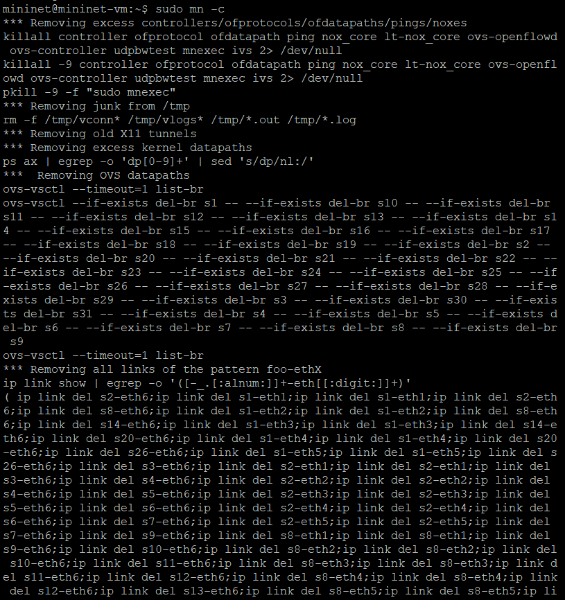
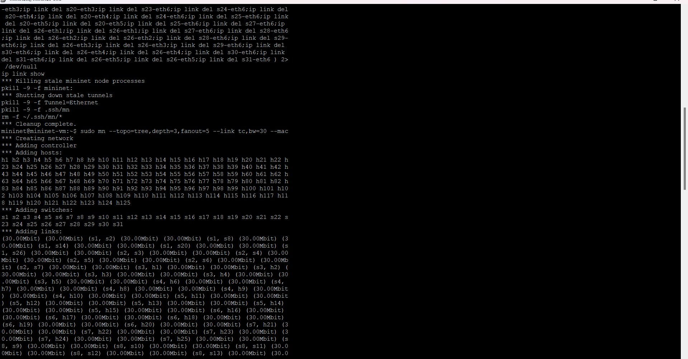
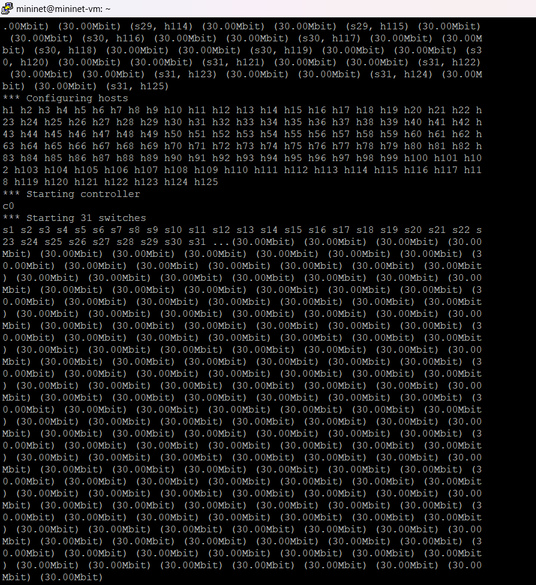

### b) Inspecione informações das interfaces, endereços MAC, IP e portas através de linhas de comando;

#### Código: 
```bash
dump
nodes
net
```

#### Resultado:
```bash
mininet> dump
<Host h1: h1-eth0:10.0.0.1 pid=4454>
<Host h2: h2-eth0:10.0.0.2 pid=4456>
<Host h3: h3-eth0:10.0.0.3 pid=4458>
<Host h4: h4-eth0:10.0.0.4 pid=4460>
<Host h5: h5-eth0:10.0.0.5 pid=4462>
<Host h6: h6-eth0:10.0.0.6 pid=4464>
<Host h7: h7-eth0:10.0.0.7 pid=4466>
<Host h8: h8-eth0:10.0.0.8 pid=4468>
<Host h9: h9-eth0:10.0.0.9 pid=4470>
<Host h10: h10-eth0:10.0.0.10 pid=4472>
<Host h11: h11-eth0:10.0.0.11 pid=4474>
<Host h12: h12-eth0:10.0.0.12 pid=4476>
<Host h13: h13-eth0:10.0.0.13 pid=4478>
<Host h14: h14-eth0:10.0.0.14 pid=4480>
<Host h15: h15-eth0:10.0.0.15 pid=4482>
<Host h16: h16-eth0:10.0.0.16 pid=4484>
<Host h17: h17-eth0:10.0.0.17 pid=4486>
<Host h18: h18-eth0:10.0.0.18 pid=4488>
<Host h19: h19-eth0:10.0.0.19 pid=4490>
<Host h20: h20-eth0:10.0.0.20 pid=4492>
<Host h21: h21-eth0:10.0.0.21 pid=4494>
<Host h22: h22-eth0:10.0.0.22 pid=4496>
<Host h23: h23-eth0:10.0.0.23 pid=4498>
<Host h24: h24-eth0:10.0.0.24 pid=4500>
<Host h25: h25-eth0:10.0.0.25 pid=4502>
<Host h26: h26-eth0:10.0.0.26 pid=4504>
<Host h27: h27-eth0:10.0.0.27 pid=4506>
<Host h28: h28-eth0:10.0.0.28 pid=4508>
<Host h29: h29-eth0:10.0.0.29 pid=4510>
<Host h30: h30-eth0:10.0.0.30 pid=4512>
<Host h31: h31-eth0:10.0.0.31 pid=4514>
<Host h32: h32-eth0:10.0.0.32 pid=4516>
<Host h33: h33-eth0:10.0.0.33 pid=4518>
<Host h34: h34-eth0:10.0.0.34 pid=4520>
<Host h35: h35-eth0:10.0.0.35 pid=4522>
<Host h36: h36-eth0:10.0.0.36 pid=4524>
<Host h37: h37-eth0:10.0.0.37 pid=4526>
<Host h38: h38-eth0:10.0.0.38 pid=4528>
<Host h39: h39-eth0:10.0.0.39 pid=4530>
<Host h40: h40-eth0:10.0.0.40 pid=4532>
<Host h41: h41-eth0:10.0.0.41 pid=4534>
<Host h42: h42-eth0:10.0.0.42 pid=4536>
<Host h43: h43-eth0:10.0.0.43 pid=4538>
<Host h44: h44-eth0:10.0.0.44 pid=4540>
<Host h45: h45-eth0:10.0.0.45 pid=4542>
<Host h46: h46-eth0:10.0.0.46 pid=4544>
<Host h47: h47-eth0:10.0.0.47 pid=4546>
<Host h48: h48-eth0:10.0.0.48 pid=4548>
<Host h49: h49-eth0:10.0.0.49 pid=4550>
<Host h50: h50-eth0:10.0.0.50 pid=4552>
<Host h51: h51-eth0:10.0.0.51 pid=4554>
<Host h52: h52-eth0:10.0.0.52 pid=4556>
<Host h53: h53-eth0:10.0.0.53 pid=4558>
<Host h54: h54-eth0:10.0.0.54 pid=4560>
<Host h55: h55-eth0:10.0.0.55 pid=4562>
<Host h56: h56-eth0:10.0.0.56 pid=4564>
<Host h57: h57-eth0:10.0.0.57 pid=4566>
<Host h58: h58-eth0:10.0.0.58 pid=4568>
<Host h59: h59-eth0:10.0.0.59 pid=4570>
<Host h60: h60-eth0:10.0.0.60 pid=4572>
<Host h61: h61-eth0:10.0.0.61 pid=4574>
<Host h62: h62-eth0:10.0.0.62 pid=4576>
<Host h63: h63-eth0:10.0.0.63 pid=4578>
<Host h64: h64-eth0:10.0.0.64 pid=4580>
<Host h65: h65-eth0:10.0.0.65 pid=4582>
<Host h66: h66-eth0:10.0.0.66 pid=4584>
<Host h67: h67-eth0:10.0.0.67 pid=4586>
<Host h68: h68-eth0:10.0.0.68 pid=4588>
<Host h69: h69-eth0:10.0.0.69 pid=4590>
<Host h70: h70-eth0:10.0.0.70 pid=4592>
<Host h71: h71-eth0:10.0.0.71 pid=4594>
<Host h72: h72-eth0:10.0.0.72 pid=4596>
<Host h73: h73-eth0:10.0.0.73 pid=4598>
<Host h74: h74-eth0:10.0.0.74 pid=4600>
<Host h75: h75-eth0:10.0.0.75 pid=4602>
<Host h76: h76-eth0:10.0.0.76 pid=4604>
<Host h77: h77-eth0:10.0.0.77 pid=4606>
<Host h78: h78-eth0:10.0.0.78 pid=4608>
<Host h79: h79-eth0:10.0.0.79 pid=4610>
<Host h80: h80-eth0:10.0.0.80 pid=4612>
<Host h81: h81-eth0:10.0.0.81 pid=4614>
<Host h82: h82-eth0:10.0.0.82 pid=4616>
<Host h83: h83-eth0:10.0.0.83 pid=4618>
<Host h84: h84-eth0:10.0.0.84 pid=4620>
<Host h85: h85-eth0:10.0.0.85 pid=4622>
<Host h86: h86-eth0:10.0.0.86 pid=4624>
<Host h87: h87-eth0:10.0.0.87 pid=4626>
<Host h88: h88-eth0:10.0.0.88 pid=4628>
<Host h89: h89-eth0:10.0.0.89 pid=4630>
<Host h90: h90-eth0:10.0.0.90 pid=4632>
<Host h91: h91-eth0:10.0.0.91 pid=4634>
<Host h92: h92-eth0:10.0.0.92 pid=4636>
<Host h93: h93-eth0:10.0.0.93 pid=4638>
<Host h94: h94-eth0:10.0.0.94 pid=4640>
<Host h95: h95-eth0:10.0.0.95 pid=4642>
<Host h96: h96-eth0:10.0.0.96 pid=4644>
<Host h97: h97-eth0:10.0.0.97 pid=4646>
<Host h98: h98-eth0:10.0.0.98 pid=4648>
<Host h99: h99-eth0:10.0.0.99 pid=4650>
<Host h100: h100-eth0:10.0.0.100 pid=4652>
<Host h101: h101-eth0:10.0.0.101 pid=4654>
<Host h102: h102-eth0:10.0.0.102 pid=4656>
<Host h103: h103-eth0:10.0.0.103 pid=4658>
<Host h104: h104-eth0:10.0.0.104 pid=4660>
<Host h105: h105-eth0:10.0.0.105 pid=4662>
<Host h106: h106-eth0:10.0.0.106 pid=4664>
<Host h107: h107-eth0:10.0.0.107 pid=4666>
<Host h108: h108-eth0:10.0.0.108 pid=4668>
<Host h109: h109-eth0:10.0.0.109 pid=4670>
<Host h110: h110-eth0:10.0.0.110 pid=4672>
<Host h111: h111-eth0:10.0.0.111 pid=4674>
<Host h112: h112-eth0:10.0.0.112 pid=4676>
<Host h113: h113-eth0:10.0.0.113 pid=4678>
<Host h114: h114-eth0:10.0.0.114 pid=4680>
<Host h115: h115-eth0:10.0.0.115 pid=4682>
<Host h116: h116-eth0:10.0.0.116 pid=4684>
<Host h117: h117-eth0:10.0.0.117 pid=4686>
<Host h118: h118-eth0:10.0.0.118 pid=4688>
<Host h119: h119-eth0:10.0.0.119 pid=4690>
<Host h120: h120-eth0:10.0.0.120 pid=4692>
<Host h121: h121-eth0:10.0.0.121 pid=4694>
<Host h122: h122-eth0:10.0.0.122 pid=4696>
<Host h123: h123-eth0:10.0.0.123 pid=4698>
<Host h124: h124-eth0:10.0.0.124 pid=4700>
<Host h125: h125-eth0:10.0.0.125 pid=4702>
<OVSSwitch s1: lo:127.0.0.1,s1-eth1:None,s1-eth2:None,s1-eth3:None,s1-eth4:None,s1-eth5:None pid=4707>
<OVSSwitch s2: lo:127.0.0.1,s2-eth1:None,s2-eth2:None,s2-eth3:None,s2-eth4:None,s2-eth5:None,s2-eth6:None pid=4710>
<OVSSwitch s3: lo:127.0.0.1,s3-eth1:None,s3-eth2:None,s3-eth3:None,s3-eth4:None,s3-eth5:None,s3-eth6:None pid=4713>
<OVSSwitch s4: lo:127.0.0.1,s4-eth1:None,s4-eth2:None,s4-eth3:None,s4-eth4:None,s4-eth5:None,s4-eth6:None pid=4716>
<OVSSwitch s5: lo:127.0.0.1,s5-eth1:None,s5-eth2:None,s5-eth3:None,s5-eth4:None,s5-eth5:None,s5-eth6:None pid=4719>
<OVSSwitch s6: lo:127.0.0.1,s6-eth1:None,s6-eth2:None,s6-eth3:None,s6-eth4:None,s6-eth5:None,s6-eth6:None pid=4722>
<OVSSwitch s7: lo:127.0.0.1,s7-eth1:None,s7-eth2:None,s7-eth3:None,s7-eth4:None,s7-eth5:None,s7-eth6:None pid=4725>
<OVSSwitch s8: lo:127.0.0.1,s8-eth1:None,s8-eth2:None,s8-eth3:None,s8-eth4:None,s8-eth5:None,s8-eth6:None pid=4728>
<OVSSwitch s9: lo:127.0.0.1,s9-eth1:None,s9-eth2:None,s9-eth3:None,s9-eth4:None,s9-eth5:None,s9-eth6:None pid=4731>
<OVSSwitch s10: lo:127.0.0.1,s10-eth1:None,s10-eth2:None,s10-eth3:None,s10-eth4:None,s10-eth5:None,s10-eth6:None pid=4734>
<OVSSwitch s11: lo:127.0.0.1,s11-eth1:None,s11-eth2:None,s11-eth3:None,s11-eth4:None,s11-eth5:None,s11-eth6:None pid=4737>
<OVSSwitch s12: lo:127.0.0.1,s12-eth1:None,s12-eth2:None,s12-eth3:None,s12-eth4:None,s12-eth5:None,s12-eth6:None pid=4740>
<OVSSwitch s13: lo:127.0.0.1,s13-eth1:None,s13-eth2:None,s13-eth3:None,s13-eth4:None,s13-eth5:None,s13-eth6:None pid=4743>
<OVSSwitch s14: lo:127.0.0.1,s14-eth1:None,s14-eth2:None,s14-eth3:None,s14-eth4:None,s14-eth5:None,s14-eth6:None pid=4746>
<OVSSwitch s15: lo:127.0.0.1,s15-eth1:None,s15-eth2:None,s15-eth3:None,s15-eth4:None,s15-eth5:None,s15-eth6:None pid=4749>
<OVSSwitch s16: lo:127.0.0.1,s16-eth1:None,s16-eth2:None,s16-eth3:None,s16-eth4:None,s16-eth5:None,s16-eth6:None pid=4752>
<OVSSwitch s17: lo:127.0.0.1,s17-eth1:None,s17-eth2:None,s17-eth3:None,s17-eth4:None,s17-eth5:None,s17-eth6:None pid=4755>
<OVSSwitch s18: lo:127.0.0.1,s18-eth1:None,s18-eth2:None,s18-eth3:None,s18-eth4:None,s18-eth5:None,s18-eth6:None pid=4758>
<OVSSwitch s19: lo:127.0.0.1,s19-eth1:None,s19-eth2:None,s19-eth3:None,s19-eth4:None,s19-eth5:None,s19-eth6:None pid=4761>
<OVSSwitch s20: lo:127.0.0.1,s20-eth1:None,s20-eth2:None,s20-eth3:None,s20-eth4:None,s20-eth5:None,s20-eth6:None pid=4764>
<OVSSwitch s21: lo:127.0.0.1,s21-eth1:None,s21-eth2:None,s21-eth3:None,s21-eth4:None,s21-eth5:None,s21-eth6:None pid=4767>
<OVSSwitch s22: lo:127.0.0.1,s22-eth1:None,s22-eth2:None,s22-eth3:None,s22-eth4:None,s22-eth5:None,s22-eth6:None pid=4770>
<OVSSwitch s23: lo:127.0.0.1,s23-eth1:None,s23-eth2:None,s23-eth3:None,s23-eth4:None,s23-eth5:None,s23-eth6:None pid=4773>
<OVSSwitch s24: lo:127.0.0.1,s24-eth1:None,s24-eth2:None,s24-eth3:None,s24-eth4:None,s24-eth5:None,s24-eth6:None pid=4776>
<OVSSwitch s25: lo:127.0.0.1,s25-eth1:None,s25-eth2:None,s25-eth3:None,s25-eth4:None,s25-eth5:None,s25-eth6:None pid=4779>
<OVSSwitch s26: lo:127.0.0.1,s26-eth1:None,s26-eth2:None,s26-eth3:None,s26-eth4:None,s26-eth5:None,s26-eth6:None pid=4782>
<OVSSwitch s27: lo:127.0.0.1,s27-eth1:None,s27-eth2:None,s27-eth3:None,s27-eth4:None,s27-eth5:None,s27-eth6:None pid=4785>
<OVSSwitch s28: lo:127.0.0.1,s28-eth1:None,s28-eth2:None,s28-eth3:None,s28-eth4:None,s28-eth5:None,s28-eth6:None pid=4788>
<OVSSwitch s29: lo:127.0.0.1,s29-eth1:None,s29-eth2:None,s29-eth3:None,s29-eth4:None,s29-eth5:None,s29-eth6:None pid=4791>
<OVSSwitch s30: lo:127.0.0.1,s30-eth1:None,s30-eth2:None,s30-eth3:None,s30-eth4:None,s30-eth5:None,s30-eth6:None pid=4794>
<OVSSwitch s31: lo:127.0.0.1,s31-eth1:None,s31-eth2:None,s31-eth3:None,s31-eth4:None,s31-eth5:None,s31-eth6:None pid=4797>
<Controller c0: 127.0.0.1:6653 pid=4447>

mininet> nodes
available nodes are:
c0 h1 h10 h100 h101 h102 h103 h104 h105 h106 h107 h108 h109 h11 h110 h111 h112 h113 h114 h115 h116 h117 h118 h119 h12 h120 h121 h122 h123 h124 h125 h13 h14 h15 h16 h17 h18 h19 h2 h20 h21 h22 h23 h24 h25 h26 h27 h28 h29 h3 h30 h31 h32 h33 h34 h35 h36 h37 h38 h39 h4 h40 h41 h42 h43 h44 h45 h46 h47 h48 h49 h5 h50 h51 h52 h53 h54 h55 h56 h57 h58 h59 h6 h60 h61 h62 h63 h64 h65 h66 h67 h68 h69 h7 h70 h71 h72 h73 h74 h75 h76 h77 h78 h79 h8 h80 h81 h82 h83 h84 h85 h86 h87 h88 h89 h9 h90 h91 h92 h93 h94 h95 h96 h97 h98 h99 s1 s10 s11 s12 s13 s14 s15 s16 s17 s18 s19 s2 s20 s21 s22 s23 s24 s25 s26 s27 s28 s29 s3 s30 s31 s4 s5 s6 s7 s8 s9

mininet> net
h1 h1-eth0:s3-eth1
h2 h2-eth0:s3-eth2
h3 h3-eth0:s3-eth3
h4 h4-eth0:s3-eth4
h5 h5-eth0:s3-eth5
h6 h6-eth0:s4-eth1
h7 h7-eth0:s4-eth2
h8 h8-eth0:s4-eth3
h9 h9-eth0:s4-eth4
h10 h10-eth0:s4-eth5
h11 h11-eth0:s5-eth1
h12 h12-eth0:s5-eth2
h13 h13-eth0:s5-eth3
h14 h14-eth0:s5-eth4
h15 h15-eth0:s5-eth5
h16 h16-eth0:s6-eth1
h17 h17-eth0:s6-eth2
h18 h18-eth0:s6-eth3
h19 h19-eth0:s6-eth4
h20 h20-eth0:s6-eth5
h21 h21-eth0:s7-eth1
h22 h22-eth0:s7-eth2
h23 h23-eth0:s7-eth3
h24 h24-eth0:s7-eth4
h25 h25-eth0:s7-eth5
h26 h26-eth0:s9-eth1
h27 h27-eth0:s9-eth2
h28 h28-eth0:s9-eth3
h29 h29-eth0:s9-eth4
h30 h30-eth0:s9-eth5
h31 h31-eth0:s10-eth1
h32 h32-eth0:s10-eth2
h33 h33-eth0:s10-eth3
h34 h34-eth0:s10-eth4
h35 h35-eth0:s10-eth5
h36 h36-eth0:s11-eth1
h37 h37-eth0:s11-eth2
h38 h38-eth0:s11-eth3
h39 h39-eth0:s11-eth4
h40 h40-eth0:s11-eth5
h41 h41-eth0:s12-eth1
h42 h42-eth0:s12-eth2
h43 h43-eth0:s12-eth3
h44 h44-eth0:s12-eth4
h45 h45-eth0:s12-eth5
h46 h46-eth0:s13-eth1
h47 h47-eth0:s13-eth2
h48 h48-eth0:s13-eth3
h49 h49-eth0:s13-eth4
h50 h50-eth0:s13-eth5
h51 h51-eth0:s15-eth1
h52 h52-eth0:s15-eth2
h53 h53-eth0:s15-eth3
h54 h54-eth0:s15-eth4
h55 h55-eth0:s15-eth5
h56 h56-eth0:s16-eth1
h57 h57-eth0:s16-eth2
h58 h58-eth0:s16-eth3
h59 h59-eth0:s16-eth4
h60 h60-eth0:s16-eth5
h61 h61-eth0:s17-eth1
h62 h62-eth0:s17-eth2
h63 h63-eth0:s17-eth3
h64 h64-eth0:s17-eth4
h65 h65-eth0:s17-eth5
h66 h66-eth0:s18-eth1
h67 h67-eth0:s18-eth2
h68 h68-eth0:s18-eth3
h69 h69-eth0:s18-eth4
h70 h70-eth0:s18-eth5
h71 h71-eth0:s19-eth1
h72 h72-eth0:s19-eth2
h73 h73-eth0:s19-eth3
h74 h74-eth0:s19-eth4
h75 h75-eth0:s19-eth5
h76 h76-eth0:s21-eth1
h77 h77-eth0:s21-eth2
h78 h78-eth0:s21-eth3
h79 h79-eth0:s21-eth4
h80 h80-eth0:s21-eth5
h81 h81-eth0:s22-eth1
h82 h82-eth0:s22-eth2
h83 h83-eth0:s22-eth3
h84 h84-eth0:s22-eth4
h85 h85-eth0:s22-eth5
h86 h86-eth0:s23-eth1
h87 h87-eth0:s23-eth2
h88 h88-eth0:s23-eth3
h89 h89-eth0:s23-eth4
h90 h90-eth0:s23-eth5
h91 h91-eth0:s24-eth1
h92 h92-eth0:s24-eth2
h93 h93-eth0:s24-eth3
h94 h94-eth0:s24-eth4
h95 h95-eth0:s24-eth5
h96 h96-eth0:s25-eth1
h97 h97-eth0:s25-eth2
h98 h98-eth0:s25-eth3
h99 h99-eth0:s25-eth4
h100 h100-eth0:s25-eth5
h101 h101-eth0:s27-eth1
h102 h102-eth0:s27-eth2
h103 h103-eth0:s27-eth3
h104 h104-eth0:s27-eth4
h105 h105-eth0:s27-eth5
h106 h106-eth0:s28-eth1
h107 h107-eth0:s28-eth2
h108 h108-eth0:s28-eth3
h109 h109-eth0:s28-eth4
h110 h110-eth0:s28-eth5
h111 h111-eth0:s29-eth1
h112 h112-eth0:s29-eth2
h113 h113-eth0:s29-eth3
h114 h114-eth0:s29-eth4
h115 h115-eth0:s29-eth5
h116 h116-eth0:s30-eth1
h117 h117-eth0:s30-eth2
h118 h118-eth0:s30-eth3
h119 h119-eth0:s30-eth4
h120 h120-eth0:s30-eth5
h121 h121-eth0:s31-eth1
h122 h122-eth0:s31-eth2
h123 h123-eth0:s31-eth3
h124 h124-eth0:s31-eth4
h125 h125-eth0:s31-eth5
s1 lo:  s1-eth1:s2-eth6 s1-eth2:s8-eth6 s1-eth3:s14-eth6 s1-eth4:s20-eth6 s1-eth5:s26-eth6
s2 lo:  s2-eth1:s3-eth6 s2-eth2:s4-eth6 s2-eth3:s5-eth6 s2-eth4:s6-eth6 s2-eth5:s7-eth6 s2-eth6:s1-eth1
s3 lo:  s3-eth1:h1-eth0 s3-eth2:h2-eth0 s3-eth3:h3-eth0 s3-eth4:h4-eth0 s3-eth5:h5-eth0 s3-eth6:s2-eth1
s4 lo:  s4-eth1:h6-eth0 s4-eth2:h7-eth0 s4-eth3:h8-eth0 s4-eth4:h9-eth0 s4-eth5:h10-eth0 s4-eth6:s2-eth2
s5 lo:  s5-eth1:h11-eth0 s5-eth2:h12-eth0 s5-eth3:h13-eth0 s5-eth4:h14-eth0 s5-eth5:h15-eth0 s5-eth6:s2-eth3
s6 lo:  s6-eth1:h16-eth0 s6-eth2:h17-eth0 s6-eth3:h18-eth0 s6-eth4:h19-eth0 s6-eth5:h20-eth0 s6-eth6:s2-eth4
s7 lo:  s7-eth1:h21-eth0 s7-eth2:h22-eth0 s7-eth3:h23-eth0 s7-eth4:h24-eth0 s7-eth5:h25-eth0 s7-eth6:s2-eth5
s8 lo:  s8-eth1:s9-eth6 s8-eth2:s10-eth6 s8-eth3:s11-eth6 s8-eth4:s12-eth6 s8-eth5:s13-eth6 s8-eth6:s1-eth2
s9 lo:  s9-eth1:h26-eth0 s9-eth2:h27-eth0 s9-eth3:h28-eth0 s9-eth4:h29-eth0 s9-eth5:h30-eth0 s9-eth6:s8-eth1
s10 lo:  s10-eth1:h31-eth0 s10-eth2:h32-eth0 s10-eth3:h33-eth0 s10-eth4:h34-eth0 s10-eth5:h35-eth0 s10-eth6:s8-eth2
s11 lo:  s11-eth1:h36-eth0 s11-eth2:h37-eth0 s11-eth3:h38-eth0 s11-eth4:h39-eth0 s11-eth5:h40-eth0 s11-eth6:s8-eth3
s12 lo:  s12-eth1:h41-eth0 s12-eth2:h42-eth0 s12-eth3:h43-eth0 s12-eth4:h44-eth0 s12-eth5:h45-eth0 s12-eth6:s8-eth4
s13 lo:  s13-eth1:h46-eth0 s13-eth2:h47-eth0 s13-eth3:h48-eth0 s13-eth4:h49-eth0 s13-eth5:h50-eth0 s13-eth6:s8-eth5
s14 lo:  s14-eth1:s15-eth6 s14-eth2:s16-eth6 s14-eth3:s17-eth6 s14-eth4:s18-eth6 s14-eth5:s19-eth6 s14-eth6:s1-eth3
s15 lo:  s15-eth1:h51-eth0 s15-eth2:h52-eth0 s15-eth3:h53-eth0 s15-eth4:h54-eth0 s15-eth5:h55-eth0 s15-eth6:s14-eth1
s16 lo:  s16-eth1:h56-eth0 s16-eth2:h57-eth0 s16-eth3:h58-eth0 s16-eth4:h59-eth0 s16-eth5:h60-eth0 s16-eth6:s14-eth2
s17 lo:  s17-eth1:h61-eth0 s17-eth2:h62-eth0 s17-eth3:h63-eth0 s17-eth4:h64-eth0 s17-eth5:h65-eth0 s17-eth6:s14-eth3
s18 lo:  s18-eth1:h66-eth0 s18-eth2:h67-eth0 s18-eth3:h68-eth0 s18-eth4:h69-eth0 s18-eth5:h70-eth0 s18-eth6:s14-eth4
s19 lo:  s19-eth1:h71-eth0 s19-eth2:h72-eth0 s19-eth3:h73-eth0 s19-eth4:h74-eth0 s19-eth5:h75-eth0 s19-eth6:s14-eth5
s20 lo:  s20-eth1:s21-eth6 s20-eth2:s22-eth6 s20-eth3:s23-eth6 s20-eth4:s24-eth6 s20-eth5:s25-eth6 s20-eth6:s1-eth4
s21 lo:  s21-eth1:h76-eth0 s21-eth2:h77-eth0 s21-eth3:h78-eth0 s21-eth4:h79-eth0 s21-eth5:h80-eth0 s21-eth6:s20-eth1
s22 lo:  s22-eth1:h81-eth0 s22-eth2:h82-eth0 s22-eth3:h83-eth0 s22-eth4:h84-eth0 s22-eth5:h85-eth0 s22-eth6:s20-eth2
s23 lo:  s23-eth1:h86-eth0 s23-eth2:h87-eth0 s23-eth3:h88-eth0 s23-eth4:h89-eth0 s23-eth5:h90-eth0 s23-eth6:s20-eth3
s24 lo:  s24-eth1:h91-eth0 s24-eth2:h92-eth0 s24-eth3:h93-eth0 s24-eth4:h94-eth0 s24-eth5:h95-eth0 s24-eth6:s20-eth4
s25 lo:  s25-eth1:h96-eth0 s25-eth2:h97-eth0 s25-eth3:h98-eth0 s25-eth4:h99-eth0 s25-eth5:h100-eth0 s25-eth6:s20-eth5
s26 lo:  s26-eth1:s27-eth6 s26-eth2:s28-eth6 s26-eth3:s29-eth6 s26-eth4:s30-eth6 s26-eth5:s31-eth6 s26-eth6:s1-eth5
s27 lo:  s27-eth1:h101-eth0 s27-eth2:h102-eth0 s27-eth3:h103-eth0 s27-eth4:h104-eth0 s27-eth5:h105-eth0 s27-eth6:s26-eth1
s28 lo:  s28-eth1:h106-eth0 s28-eth2:h107-eth0 s28-eth3:h108-eth0 s28-eth4:h109-eth0 s28-eth5:h110-eth0 s28-eth6:s26-eth2
s29 lo:  s29-eth1:h111-eth0 s29-eth2:h112-eth0 s29-eth3:h113-eth0 s29-eth4:h114-eth0 s29-eth5:h115-eth0 s29-eth6:s26-eth3
s30 lo:  s30-eth1:h116-eth0 s30-eth2:h117-eth0 s30-eth3:h118-eth0 s30-eth4:h119-eth0 s30-eth5:h120-eth0 s30-eth6:s26-eth4
s31 lo:  s31-eth1:h121-eth0 s31-eth2:h122-eth0 s31-eth3:h123-eth0 s31-eth4:h124-eth0 s31-eth5:h125-eth0 s31-eth6:s26-eth5
c0
```

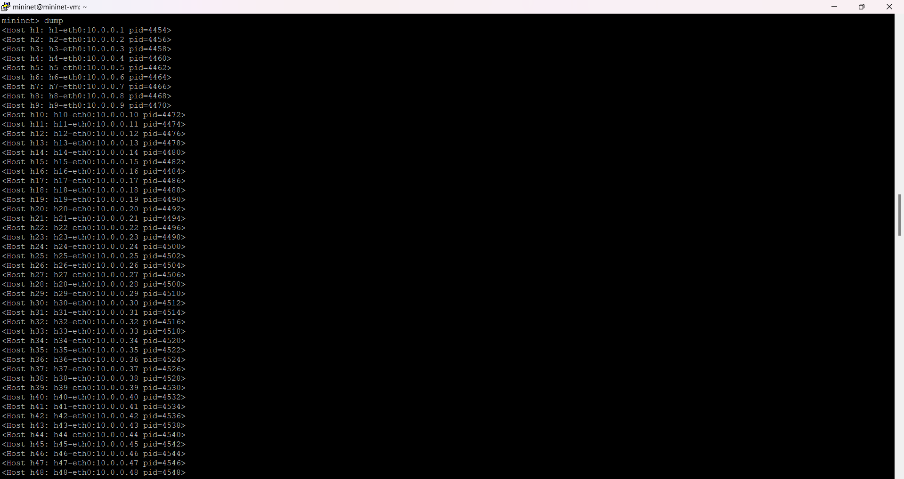
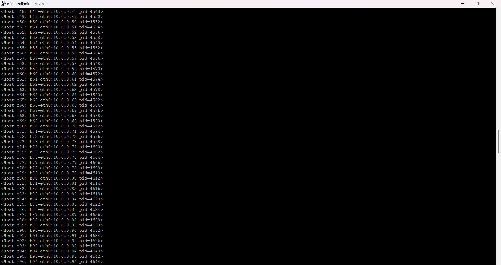
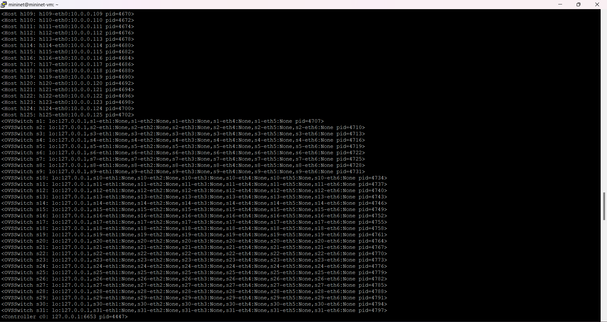
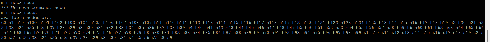
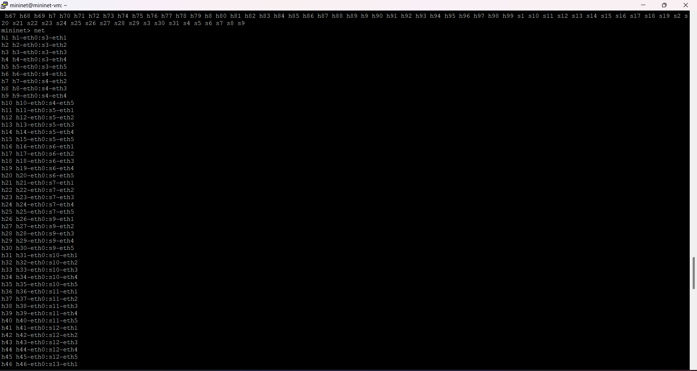
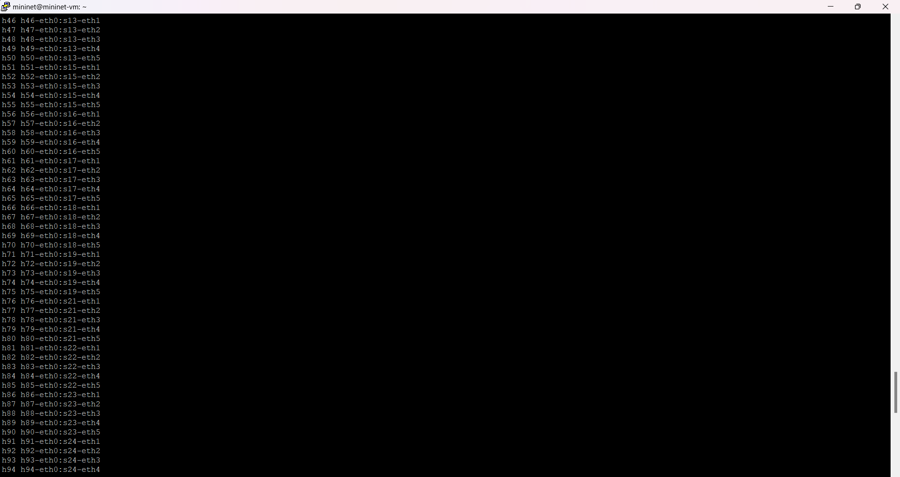

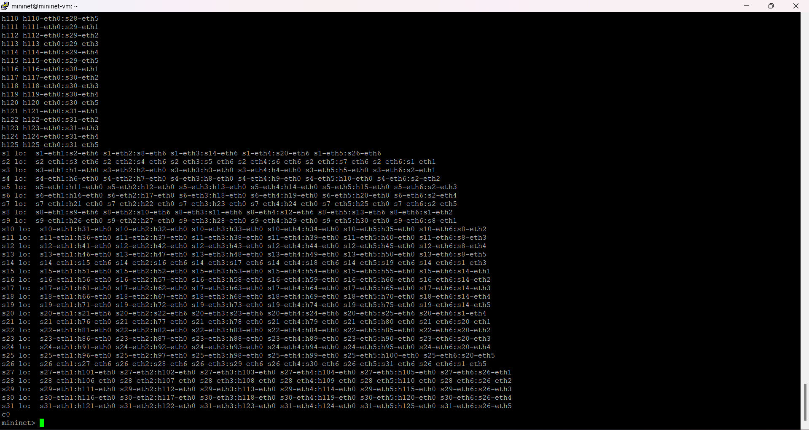

### c) Crie um desenho ilustrativo da topologia com todas as informações obtidas no item anterior;
Nota: foi utilizado mermaid.js para o diagrama. Um visualizador online permite validar o código abaixo
```mermaid.js
graph TD

    %% ---------------------------
    %% S1 – raiz do cluster
    %% ---------------------------
    s1 --- s2
    s1 --- s8
    s1 --- s14
    s1 --- s20
    s1 --- s26

    %% ---------------------------
    %% S2 – cluster intermediário
    %% ---------------------------
    s2 --- s3
    s2 --- s4
    s2 --- s5
    s2 --- s6
    s2 --- s7

    %% ---------------------------
    %% S3 – hosts 1–5
    %% ---------------------------
    s3 --> h1_5["h1–h5 (10.0.0.1 → 10.0.0.5)"]

    %% ---------------------------
    %% S4 – hosts 6–10
    %% ---------------------------
    s4 --> h6_10["h6–h10 (10.0.0.6 → 10.0.0.10)"]

    %% ---------------------------
    %% S5 – hosts 11–15
    %% ---------------------------
    s5 --> h11_15["h11–h15 (10.0.0.11 → 10.0.0.15)"]

    %% ---------------------------
    %% S6 – hosts 16–20
    %% ---------------------------
    s6 --> h16_20["h16–h20 (10.0.0.16 → 10.0.0.20)"]

    %% ---------------------------
    %% S7 – hosts 21–25
    %% ---------------------------
    s7 --> h21_25["h21–h25 (10.0.0.21 → 10.0.0.25)"]


    %% ---------------------------
    %% S8 – cluster 9–13
    %% ---------------------------
    s8 --- s9
    s8 --- s10
    s8 --- s11
    s8 --- s12
    s8 --- s13

    %% S9 hosts 26–30
    s9 --> h26_30["h26–h30 (10.0.0.26 → 10.0.0.30)"]

    %% S10 hosts 31–35
    s10 --> h31_35["h31–h35 (10.0.0.31 → 10.0.0.35)"]

    %% S11 hosts 36–40
    s11 --> h36_40["h36–h40 (10.0.0.36 → 10.0.0.40)"]

    %% S12 hosts 41–45
    s12 --> h41_45["h41–h45 (10.0.0.41 → 10.0.0.45)"]

    %% S13 hosts 46–50
    s13 --> h46_50["h46–h50 (10.0.0.46 → 10.0.0.50)"]


    %% ---------------------------
    %% S14 – cluster 15–19
    %% ---------------------------
    s14 --- s15
    s14 --- s16
    s14 --- s17
    s14 --- s18
    s14 --- s19

    %% S15 hosts 51–55
    s15 --> h51_55["h51–h55 (10.0.0.51 → 10.0.0.55)"]

    %% S16 hosts 56–60
    s16 --> h56_60["h56–h60 (10.0.0.56 → 10.0.0.60)"]

    %% S17 hosts 61–65
    s17 --> h61_65["h61–h65 (10.0.0.61 → 10.0.0.65)"]

    %% S18 hosts 66–70
    s18 --> h66_70["h66–h70 (10.0.0.66 → 10.0.0.70)"]

    %% S19 hosts 71–75
    s19 --> h71_75["h71–h75 (10.0.0.71 → 10.0.0.75)"]


    %% ---------------------------
    %% S20 – cluster 21–25
    %% ---------------------------
    s20 --- s21
    s20 --- s22
    s20 --- s23
    s20 --- s24
    s20 --- s25

    %% S21 hosts 76–80
    s21 --> h76_80["h76–h80 (10.0.0.76 → 10.0.0.80)"]

    %% S22 hosts 81–85
    s22 --> h81_85["h81–h85 (10.0.0.81 → 10.0.0.85)"]

    %% S23 hosts 86–90
    s23 --> h86_90["h86–h90 (10.0.0.86 → 10.0.0.90)"]

    %% S24 hosts 91–95
    s24 --> h91_95["h91–h95 (10.0.0.91 → 10.0.0.95)"]

    %% S25 hosts 96–100
    s25 --> h96_100["h96–h100 (10.0.0.96 → 10.0.0.100)"]


    %% ---------------------------
    %% S26 – cluster 27–31
    %% ---------------------------
    s26 --- s27
    s26 --- s28
    s26 --- s29
    s26 --- s30
    s26 --- s31

    %% S27 hosts 101–105
    s27 --> h101_105["h101–h105 (10.0.0.101 → 10.0.0.105)"]

    %% S28 hosts 106–110
    s28 --> h106_110["h106–h110 (10.0.0.106 → 10.0.0.110)"]

    %% S29 hosts 111–115
    s29 --> h111_115["h111–h115 (10.0.0.111 → 10.0.0.115)"]

    %% S30 hosts 116–120
    s30 --> h116_120["h116–h120 (10.0.0.116 → 10.0.0.120)"]

    %% S31 hosts 121–125
    s31 --> h121_125["h121–h125 (10.0.0.121 → 10.0.0.125)"]
```
Exemplo de parte do diagrama
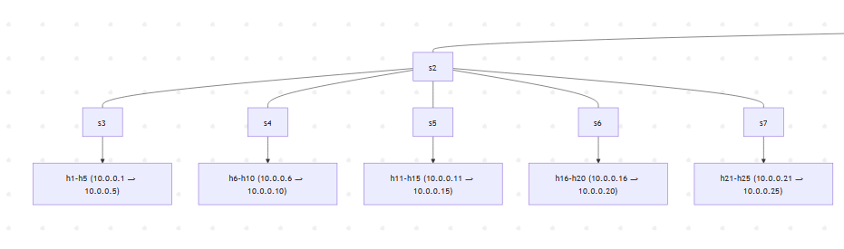

### d) Execute testes de ping entre os diferentes nós, mostre os pacotes chegando nos nós com uso do comando tcpdump.

#### Código
```bash
#Putty
mininet> xterm h1 h2 h23 h24 h124 h125
mininet> h1 ping -c 5 h2
mininet> h125 ping -c 5 h24
mininet> h23 ping -c 5 h124
```
#### Resultado
```bash
# h1 ping -c 5 h2
PING 10.0.0.2 (10.0.0.2) 56(84) bytes of data.
64 bytes from 10.0.0.2: icmp_seq=1 ttl=64 time=65.0 ms
64 bytes from 10.0.0.2: icmp_seq=2 ttl=64 time=4.37 ms
64 bytes from 10.0.0.2: icmp_seq=3 ttl=64 time=0.145 ms
64 bytes from 10.0.0.2: icmp_seq=4 ttl=64 time=0.060 ms
64 bytes from 10.0.0.2: icmp_seq=5 ttl=64 time=0.040 ms

--- 10.0.0.2 ping statistics ---
5 packets transmitted, 5 received, 0% packet loss, time 4001ms
rtt min/avg/max/mdev = 0.040/13.940/65.080/25.624 ms

# h23 ping -c 5 h124
PING 10.0.0.124 (10.0.0.124) 56(84) bytes of data.
64 bytes from 10.0.0.124: icmp_seq=1 ttl=64 time=37.3 ms
64 bytes from 10.0.0.124: icmp_seq=2 ttl=64 time=6.52 ms
64 bytes from 10.0.0.124: icmp_seq=3 ttl=64 time=0.053 ms
64 bytes from 10.0.0.124: icmp_seq=4 ttl=64 time=0.054 ms
64 bytes from 10.0.0.124: icmp_seq=5 ttl=64 time=0.053 ms

--- 10.0.0.124 ping statistics ---
5 packets transmitted, 5 received, 0% packet loss, time 4003ms
rtt min/avg/max/mdev = 0.053/8.797/37.305/14.472 ms

# h125 ping -c 5 h24
PING 10.0.0.24 (10.0.0.24) 56(84) bytes of data.
64 bytes from 10.0.0.24: icmp_seq=1 ttl=64 time=38.4 ms
64 bytes from 10.0.0.24: icmp_seq=2 ttl=64 time=3.79 ms
64 bytes from 10.0.0.24: icmp_seq=3 ttl=64 time=0.053 ms
64 bytes from 10.0.0.24: icmp_seq=4 ttl=64 time=0.050 ms
64 bytes from 10.0.0.24: icmp_seq=5 ttl=64 time=0.052 ms

--- 10.0.0.24 ping statistics ---
5 packets transmitted, 5 received, 0% packet loss, time 4002ms
rtt min/avg/max/mdev = 0.050/8.473/38.420/15.043 ms
```

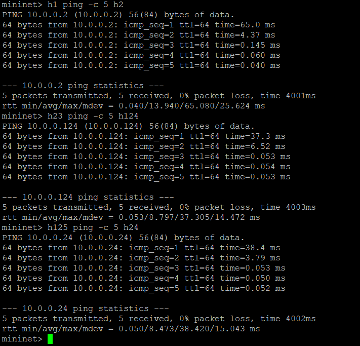
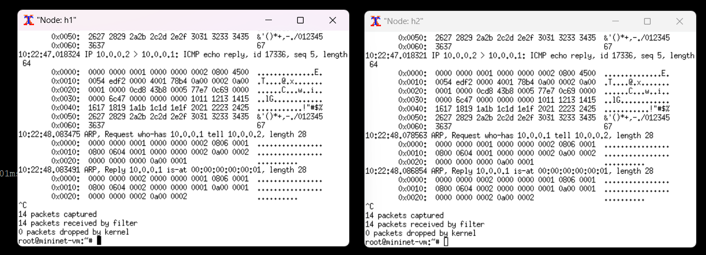
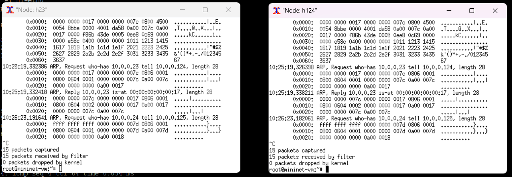
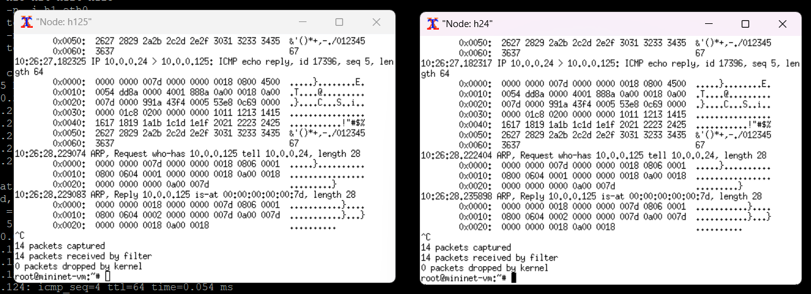

### e) Especifique que o host 1 na porta 5555 vai ser um servidor TCP e o host 2 um cliente e execute testes de iperf, considere um relatório por segundo com teste de 20 segundos. Faça os testes para larguras de banda bw de 30 e 40 Mbps (Necessário reconstruir a topologia para os outros valores).

#### Código

#### Resultado
##### Para uma banda de 30Mbps
```bash
# mininet
mininet> xterm h1 h2

# h1 (servidor)
root@mininet-vm:# iperf -s -p 5555
------------------------------------------------------------
Server listening on TCP port 5555
TCP window size: 85.3 KByte (default)
------------------------------------------------------------
[320] local 10.0.0.1 port 5555 connected with 10.0.0.2 port 33258
[ ID] Interval       Transfer     Bandwidth
[320] 0.0-20.0 sec  65.8 MBytes  27.3 Mbits/sec


# h2 (cliente)
root@mininet-vm:# iperf -c 10.0.0.1 -p 5555 -i 1 -t 20
------------------------------------------------------------
Client connecting to 10.0.0.1, TCP port 5555
TCP window size: 85.3 KByte (default)
------------------------------------------------------------
[319] local 10.0.0.2 port 33258 connected with 10.0.0.1 port 5555
[ ID] Interval       Transfer     Bandwidth
[319] 0.0- 1.0 sec   3.38 MBytes  28.3 Mbits/sec
[319] 1.0- 2.0 sec   3.12 MBytes  26.2 Mbits/sec
[319] 2.0- 3.0 sec   3.38 MBytes  28.3 Mbits/sec
[319] 3.0- 4.0 sec   3.25 MBytes  27.3 Mbits/sec
[319] 4.0- 5.0 sec   3.25 MBytes  27.3 Mbits/sec
[319] 5.0- 6.0 sec   3.50 MBytes  29.4 Mbits/sec
[319] 6.0- 7.0 sec   3.25 MBytes  27.3 Mbits/sec
[319] 7.0- 8.0 sec   3.25 MBytes  27.3 Mbits/sec
[319] 8.0- 9.0 sec   3.12 MBytes  26.2 Mbits/sec
[319] 9.0-10.0 sec   3.25 MBytes  27.3 Mbits/sec
[319] 10.0-11.0 sec  3.25 MBytes  27.3 Mbits/sec
[319] 11.0-12.0 sec  3.25 MBytes  27.3 Mbits/sec
[319] 12.0-13.0 sec  3.50 MBytes  29.4 Mbits/sec
[319] 13.0-14.0 sec  2.88 MBytes  24.1 Mbits/sec
[319] 14.0-15.0 sec  3.50 MBytes  29.4 Mbits/sec
[319] 15.0-16.0 sec  3.25 MBytes  27.3 Mbits/sec
[319] 16.0-17.0 sec  3.25 MBytes  27.3 Mbits/sec
[319] 17.0-18.0 sec  3.25 MBytes  27.3 Mbits/sec
[319] 18.0-19.0 sec  3.50 MBytes  29.4 Mbits/sec
[319] 19.0-20.0 sec  3.25 MBytes  27.3 Mbits/sec
[319] 0.0-20.0 sec  65.8 MBytes  27.5 Mbits/sec
```

##### Para uma banda de 40Mbps
```bash
# mininet

# h1 (servidor)
root@mininet-vm:# iperf -s -p 5555
------------------------------------------------------------
Server listening on TCP port 5555
TCP window size: 85.3 KByte (default)
------------------------------------------------------------
[320] local 10.0.0.1 port 5555 connected with 10.0.0.2 port 33680
[320] 0.0-20.0 sec  89.2 MBytes  37.1 Mbits/sec

# h2 (cliente)
"Node: h2"
root@mininet-vm:# iperf -c 10.0.0.1 -p 5555 -i 1 -t 20
------------------------------------------------------------
Client connecting to 10.0.0.1, TCP port 5555
TCP window size: 85.3 KByte (default)
------------------------------------------------------------
[319] local 10.0.0.2 port 33680 connected with 10.0.0.1 port 5555
[ ID] Interval       Transfer     Bandwidth
[319] 0.0- 1.0 sec   4.88 MBytes  40.9 Mbits/sec
[319] 1.0- 2.0 sec   4.38 MBytes  36.7 Mbits/sec
[319] 2.0- 3.0 sec   4.50 MBytes  37.7 Mbits/sec
[319] 3.0- 4.0 sec   4.25 MBytes  35.7 Mbits/sec
[319] 4.0- 5.0 sec   4.50 MBytes  37.7 Mbits/sec
[319] 5.0- 6.0 sec   4.38 MBytes  36.7 Mbits/sec
[319] 6.0- 7.0 sec   4.25 MBytes  35.7 Mbits/sec
[319] 7.0- 8.0 sec   4.50 MBytes  37.7 Mbits/sec
[319] 8.0- 9.0 sec   4.50 MBytes  37.7 Mbits/sec
[319] 9.0-10.0 sec   4.52 MBytes  38.8 Mbits/sec
[319] 10.0-11.0 sec  4.50 MBytes  37.7 Mbits/sec
[319] 11.0-12.0 sec  4.38 MBytes  36.7 Mbits/sec
[319] 12.0-13.0 sec  4.50 MBytes  37.7 Mbits/sec
[319] 13.0-14.0 sec  4.50 MBytes  37.7 Mbits/sec
[319] 14.0-15.0 sec  4.50 MBytes  37.7 Mbits/sec
[319] 15.0-16.0 sec  4.50 MBytes  37.7 Mbits/sec
[319] 16.0-17.0 sec  4.12 MBytes  34.6 Mbits/sec
[319] 17.0-18.0 sec  4.50 MBytes  37.7 Mbits/sec
[319] 18.0-19.0 sec  4.50 MBytes  37.7 Mbits/sec
[319] 19.0-20.0 sec  4.50 MBytes  37.7 Mbits/sec
[319] 0.0-20.0 sec  89.2 MBytes  37.4 Mbits/sec
```


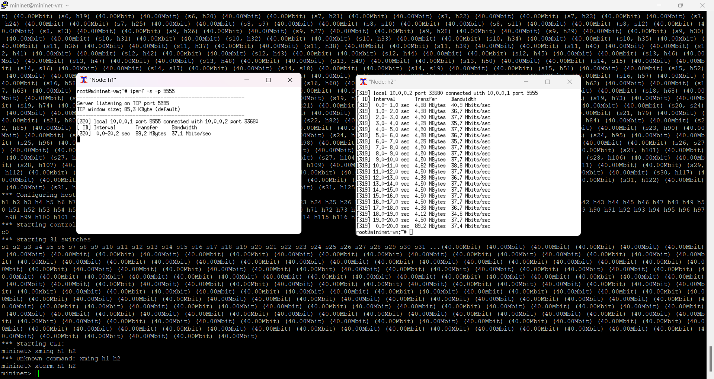