# Relatório Trabalho Final Mininet - Questão 2

## 2. Crie um código Python para a topologia customizada abaixo
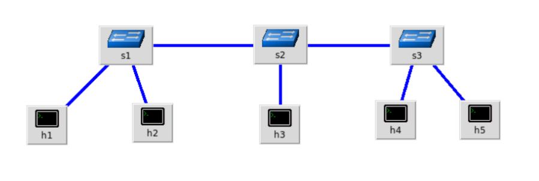

### a) Com uso de linha de comando padrão do Mininet, crie a topologia customizada considerando o endereço MAC padronizado e controlador manual;

#### Resultado
```bash
mininet@mininet-vm:~/C115/trabalho-final-mininet/questao-2$ sudo python topology                                                                                                             .py
*** Creating network
*** Adding hosts:
h1 h2 h3 h4 h5
*** Adding switches:
s1 s2 s3
*** Adding links:
(h1, s1) (h2, s1) (h3, s2) (h4, s3) (h5, s3) (s1, s2) (s2, s3)
*** Configuring hosts
h1 h2 h3 h4 h5
*** Starting controller

*** Starting 3 switches
s1 s2 s3 ...
```
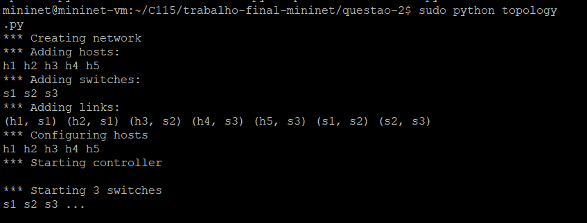

### b) Inspecione informações das interfaces, endereços MAC, IP e portas através de linhas de comando;

#### Resultado
```bash
#### Inspecao dos hosts ####
*** Starting CLI:
available nodes are:
h1 h2 h3 h4 h5 s1 s2 s3
h1 h1-eth0:s1-eth1
h2 h2-eth0:s1-eth2
h3 h3-eth0:s2-eth1
h4 h4-eth0:s3-eth1
h5 h5-eth0:s3-eth2
s1 lo:  s1-eth1:h1-eth0 s1-eth2:h2-eth0 s1-eth3:s2-eth2
s2 lo:  s2-eth1:h3-eth0 s2-eth2:s1-eth3 s2-eth3:s3-eth3
s3 lo:  s3-eth1:h4-eth0 s3-eth2:h5-eth0 s3-eth3:s2-eth3
<Host h1: h1-eth0:192.168.0.1 pid=7666>
<Host h2: h2-eth0:192.168.0.2 pid=7668>
<Host h3: h3-eth0:192.168.0.3 pid=7670>
<Host h4: h4-eth0:192.168.0.4 pid=7672>
<Host h5: h5-eth0:192.168.0.5 pid=7674>
<OVSSwitch s1: lo:127.0.0.1,s1-eth1:None,s1-eth2:None,s1-eth3:None pid=7679>
<OVSSwitch s2: lo:127.0.0.1,s2-eth1:None,s2-eth2:None,s2-eth3:None pid=7682>
<OVSSwitch s3: lo:127.0.0.1,s3-eth1:None,s3-eth2:None,s3-eth3:None pid=7685>
h1-eth0   Link encap:Ethernet  HWaddr 00:00:00:00:00:01
          inet addr:192.168.0.1  Bcast:192.168.0.15  Mask:255.255.255.240
          UP BROADCAST RUNNING MULTICAST  MTU:1500  Metric:1
          RX packets:0 errors:0 dropped:0 overruns:0 frame:0
          TX packets:0 errors:0 dropped:0 overruns:0 carrier:0
          collisions:0 txqueuelen:1000
          RX bytes:0 (0.0 B)  TX bytes:0 (0.0 B)

lo        Link encap:Local Loopback
          inet addr:127.0.0.1  Mask:255.0.0.0
          UP LOOPBACK RUNNING  MTU:65536  Metric:1
          RX packets:0 errors:0 dropped:0 overruns:0 frame:0
          TX packets:0 errors:0 dropped:0 overruns:0 carrier:0
          collisions:0 txqueuelen:0
          RX bytes:0 (0.0 B)  TX bytes:0 (0.0 B)

h2-eth0   Link encap:Ethernet  HWaddr 00:00:00:00:00:02
          inet addr:192.168.0.2  Bcast:192.168.0.15  Mask:255.255.255.240
          UP BROADCAST RUNNING MULTICAST  MTU:1500  Metric:1
          RX packets:0 errors:0 dropped:0 overruns:0 frame:0
          TX packets:0 errors:0 dropped:0 overruns:0 carrier:0
          collisions:0 txqueuelen:1000
          RX bytes:0 (0.0 B)  TX bytes:0 (0.0 B)

lo        Link encap:Local Loopback
          inet addr:127.0.0.1  Mask:255.0.0.0
          UP LOOPBACK RUNNING  MTU:65536  Metric:1
          RX packets:0 errors:0 dropped:0 overruns:0 frame:0
          TX packets:0 errors:0 dropped:0 overruns:0 carrier:0
          collisions:0 txqueuelen:0
          RX bytes:0 (0.0 B)  TX bytes:0 (0.0 B)

h3-eth0   Link encap:Ethernet  HWaddr 00:00:00:00:00:03
          inet addr:192.168.0.3  Bcast:192.168.0.15  Mask:255.255.255.240
          UP BROADCAST RUNNING MULTICAST  MTU:1500  Metric:1
          RX packets:0 errors:0 dropped:0 overruns:0 frame:0
          TX packets:0 errors:0 dropped:0 overruns:0 carrier:0
          collisions:0 txqueuelen:1000
          RX bytes:0 (0.0 B)  TX bytes:0 (0.0 B)

lo        Link encap:Local Loopback
          inet addr:127.0.0.1  Mask:255.0.0.0
          UP LOOPBACK RUNNING  MTU:65536  Metric:1
          RX packets:0 errors:0 dropped:0 overruns:0 frame:0
          TX packets:0 errors:0 dropped:0 overruns:0 carrier:0
          collisions:0 txqueuelen:0
          RX bytes:0 (0.0 B)  TX bytes:0 (0.0 B)

h4-eth0   Link encap:Ethernet  HWaddr 00:00:00:00:00:04
          inet addr:192.168.0.4  Bcast:192.168.0.15  Mask:255.255.255.240
          UP BROADCAST RUNNING MULTICAST  MTU:1500  Metric:1
          RX packets:0 errors:0 dropped:0 overruns:0 frame:0
          TX packets:0 errors:0 dropped:0 overruns:0 carrier:0
          collisions:0 txqueuelen:1000
          RX bytes:0 (0.0 B)  TX bytes:0 (0.0 B)

lo        Link encap:Local Loopback
          inet addr:127.0.0.1  Mask:255.0.0.0
          UP LOOPBACK RUNNING  MTU:65536  Metric:1
          RX packets:0 errors:0 dropped:0 overruns:0 frame:0
          TX packets:0 errors:0 dropped:0 overruns:0 carrier:0
          collisions:0 txqueuelen:0
          RX bytes:0 (0.0 B)  TX bytes:0 (0.0 B)

h5-eth0   Link encap:Ethernet  HWaddr 00:00:00:00:00:05
          inet addr:192.168.0.5  Bcast:192.168.0.15  Mask:255.255.255.240
          UP BROADCAST RUNNING MULTICAST  MTU:1500  Metric:1
          RX packets:0 errors:0 dropped:0 overruns:0 frame:0
          TX packets:0 errors:0 dropped:0 overruns:0 carrier:0
          collisions:0 txqueuelen:1000
          RX bytes:0 (0.0 B)  TX bytes:0 (0.0 B)

lo        Link encap:Local Loopback
          inet addr:127.0.0.1  Mask:255.0.0.0
          UP LOOPBACK RUNNING  MTU:65536  Metric:1
          RX packets:0 errors:0 dropped:0 overruns:0 frame:0
          TX packets:0 errors:0 dropped:0 overruns:0 carrier:0
          collisions:0 txqueuelen:0
          RX bytes:0 (0.0 B)  TX bytes:0 (0.0 B)
```

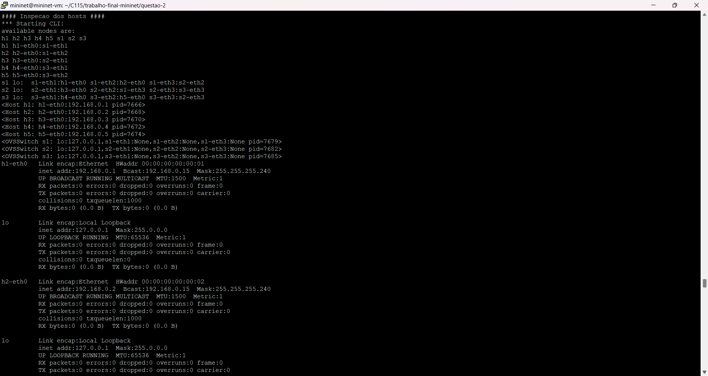
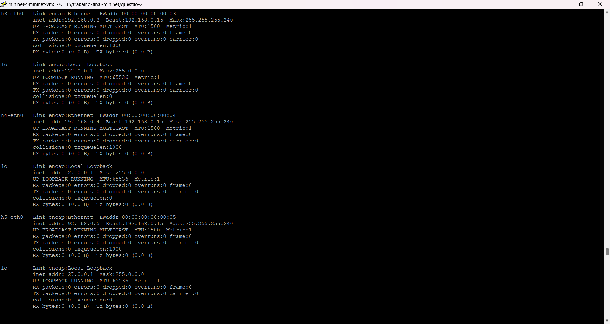

### c) Crie um desenho ilustrativo da topologia com todas as informações obtidas no item anterior;

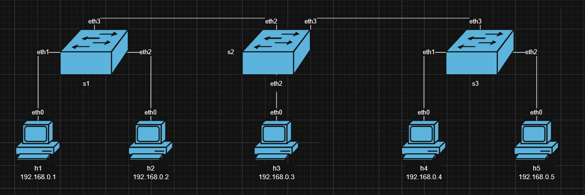

### e)

#### Resultado
```bash
### Teste de ping ###
*** Starting CLI:
*** Unknown command: echo "Rodando Script"
PING 192.168.0.2 (192.168.0.2) 56(84) bytes of data.
64 bytes from 192.168.0.2: icmp_seq=1 ttl=64 time=1.19 ms
64 bytes from 192.168.0.2: icmp_seq=2 ttl=64 time=0.026 ms

--- 192.168.0.2 ping statistics ---
2 packets transmitted, 2 received, 0% packet loss, time 1002ms
rtt min/avg/max/mdev = 0.026/0.609/1.192/0.583 ms
PING 192.168.0.3 (192.168.0.3) 56(84) bytes of data.
64 bytes from 192.168.0.3: icmp_seq=1 ttl=64 time=0.703 ms
64 bytes from 192.168.0.3: icmp_seq=2 ttl=64 time=0.030 ms

--- 192.168.0.3 ping statistics ---
2 packets transmitted, 2 received, 0% packet loss, time 1002ms
rtt min/avg/max/mdev = 0.030/0.366/0.703/0.337 ms
PING 192.168.0.4 (192.168.0.4) 56(84) bytes of data.
64 bytes from 192.168.0.4: icmp_seq=1 ttl=64 time=0.996 ms
64 bytes from 192.168.0.4: icmp_seq=2 ttl=64 time=0.031 ms

--- 192.168.0.4 ping statistics ---
2 packets transmitted, 2 received, 0% packet loss, time 1001ms
rtt min/avg/max/mdev = 0.031/0.513/0.996/0.483 ms
PING 192.168.0.5 (192.168.0.5) 56(84) bytes of data.
64 bytes from 192.168.0.5: icmp_seq=1 ttl=64 time=1.11 ms
64 bytes from 192.168.0.5: icmp_seq=2 ttl=64 time=0.030 ms

--- 192.168.0.5 ping statistics ---
2 packets transmitted, 2 received, 0% packet loss, time 1002ms
rtt min/avg/max/mdev = 0.030/0.574/1.119/0.545 ms
PING 192.168.0.1 (192.168.0.1) 56(84) bytes of data.
64 bytes from 192.168.0.1: icmp_seq=1 ttl=64 time=0.017 ms
64 bytes from 192.168.0.1: icmp_seq=2 ttl=64 time=0.054 ms

--- 192.168.0.1 ping statistics ---
2 packets transmitted, 2 received, 0% packet loss, time 999ms
rtt min/avg/max/mdev = 0.017/0.035/0.054/0.019 ms
PING 192.168.0.3 (192.168.0.3) 56(84) bytes of data.
64 bytes from 192.168.0.3: icmp_seq=1 ttl=64 time=0.812 ms
64 bytes from 192.168.0.3: icmp_seq=2 ttl=64 time=0.024 ms

--- 192.168.0.3 ping statistics ---
2 packets transmitted, 2 received, 0% packet loss, time 999ms
rtt min/avg/max/mdev = 0.024/0.418/0.812/0.394 ms
PING 192.168.0.4 (192.168.0.4) 56(84) bytes of data.
64 bytes from 192.168.0.4: icmp_seq=1 ttl=64 time=1.02 ms
64 bytes from 192.168.0.4: icmp_seq=2 ttl=64 time=0.032 ms

--- 192.168.0.4 ping statistics ---
2 packets transmitted, 2 received, 0% packet loss, time 1001ms
rtt min/avg/max/mdev = 0.032/0.529/1.026/0.497 ms
PING 192.168.0.5 (192.168.0.5) 56(84) bytes of data.
64 bytes from 192.168.0.5: icmp_seq=1 ttl=64 time=1.06 ms
64 bytes from 192.168.0.5: icmp_seq=2 ttl=64 time=0.031 ms

--- 192.168.0.5 ping statistics ---
2 packets transmitted, 2 received, 0% packet loss, time 1002ms
rtt min/avg/max/mdev = 0.031/0.546/1.062/0.516 ms
PING 192.168.0.1 (192.168.0.1) 56(84) bytes of data.
64 bytes from 192.168.0.1: icmp_seq=1 ttl=64 time=0.270 ms
64 bytes from 192.168.0.1: icmp_seq=2 ttl=64 time=0.030 ms

--- 192.168.0.1 ping statistics ---
2 packets transmitted, 2 received, 0% packet loss, time 999ms
rtt min/avg/max/mdev = 0.030/0.150/0.270/0.120 ms
PING 192.168.0.2 (192.168.0.2) 56(84) bytes of data.
64 bytes from 192.168.0.2: icmp_seq=1 ttl=64 time=0.022 ms
64 bytes from 192.168.0.2: icmp_seq=2 ttl=64 time=0.027 ms

--- 192.168.0.2 ping statistics ---
2 packets transmitted, 2 received, 0% packet loss, time 999ms
rtt min/avg/max/mdev = 0.022/0.024/0.027/0.005 ms
PING 192.168.0.4 (192.168.0.4) 56(84) bytes of data.
64 bytes from 192.168.0.4: icmp_seq=1 ttl=64 time=0.779 ms
64 bytes from 192.168.0.4: icmp_seq=2 ttl=64 time=0.026 ms

--- 192.168.0.4 ping statistics ---
2 packets transmitted, 2 received, 0% packet loss, time 999ms
rtt min/avg/max/mdev = 0.026/0.402/0.779/0.377 ms
PING 192.168.0.5 (192.168.0.5) 56(84) bytes of data.
64 bytes from 192.168.0.5: icmp_seq=1 ttl=64 time=0.673 ms
64 bytes from 192.168.0.5: icmp_seq=2 ttl=64 time=0.031 ms

--- 192.168.0.5 ping statistics ---
2 packets transmitted, 2 received, 0% packet loss, time 1001ms
rtt min/avg/max/mdev = 0.031/0.352/0.673/0.321 ms
PING 192.168.0.1 (192.168.0.1) 56(84) bytes of data.
64 bytes from 192.168.0.1: icmp_seq=1 ttl=64 time=0.384 ms
64 bytes from 192.168.0.1: icmp_seq=2 ttl=64 time=0.031 ms

--- 192.168.0.1 ping statistics ---
2 packets transmitted, 2 received, 0% packet loss, time 1000ms
rtt min/avg/max/mdev = 0.031/0.207/0.384/0.177 ms
PING 192.168.0.2 (192.168.0.2) 56(84) bytes of data.
64 bytes from 192.168.0.2: icmp_seq=1 ttl=64 time=0.486 ms
64 bytes from 192.168.0.2: icmp_seq=2 ttl=64 time=0.028 ms

--- 192.168.0.2 ping statistics ---
2 packets transmitted, 2 received, 0% packet loss, time 999ms
rtt min/avg/max/mdev = 0.028/0.257/0.486/0.229 ms
PING 192.168.0.3 (192.168.0.3) 56(84) bytes of data.
64 bytes from 192.168.0.3: icmp_seq=1 ttl=64 time=0.020 ms
64 bytes from 192.168.0.3: icmp_seq=2 ttl=64 time=0.026 ms

--- 192.168.0.3 ping statistics ---
2 packets transmitted, 2 received, 0% packet loss, time 999ms
rtt min/avg/max/mdev = 0.020/0.023/0.026/0.003 ms
PING 192.168.0.5 (192.168.0.5) 56(84) bytes of data.
64 bytes from 192.168.0.5: icmp_seq=1 ttl=64 time=0.409 ms
64 bytes from 192.168.0.5: icmp_seq=2 ttl=64 time=0.028 ms

--- 192.168.0.5 ping statistics ---
2 packets transmitted, 2 received, 0% packet loss, time 1001ms
rtt min/avg/max/mdev = 0.028/0.218/0.409/0.191 ms
PING 192.168.0.1 (192.168.0.1) 56(84) bytes of data.
64 bytes from 192.168.0.1: icmp_seq=1 ttl=64 time=0.371 ms
64 bytes from 192.168.0.1: icmp_seq=2 ttl=64 time=0.027 ms

--- 192.168.0.1 ping statistics ---
2 packets transmitted, 2 received, 0% packet loss, time 999ms
rtt min/avg/max/mdev = 0.027/0.199/0.371/0.172 ms
PING 192.168.0.2 (192.168.0.2) 56(84) bytes of data.
64 bytes from 192.168.0.2: icmp_seq=1 ttl=64 time=0.429 ms
64 bytes from 192.168.0.2: icmp_seq=2 ttl=64 time=0.026 ms

--- 192.168.0.2 ping statistics ---
2 packets transmitted, 2 received, 0% packet loss, time 999ms
rtt min/avg/max/mdev = 0.026/0.227/0.429/0.202 ms
PING 192.168.0.3 (192.168.0.3) 56(84) bytes of data.
64 bytes from 192.168.0.3: icmp_seq=1 ttl=64 time=0.291 ms
64 bytes from 192.168.0.3: icmp_seq=2 ttl=64 time=0.025 ms

--- 192.168.0.3 ping statistics ---
2 packets transmitted, 2 received, 0% packet loss, time 999ms
rtt min/avg/max/mdev = 0.025/0.158/0.291/0.133 ms
PING 192.168.0.4 (192.168.0.4) 56(84) bytes of data.
64 bytes from 192.168.0.4: icmp_seq=1 ttl=64 time=0.018 ms
64 bytes from 192.168.0.4: icmp_seq=2 ttl=64 time=0.025 ms

--- 192.168.0.4 ping statistics ---
2 packets transmitted, 2 received, 0% packet loss, time 999ms
rtt min/avg/max/mdev = 0.018/0.021/0.025/0.005 ms
*** Ping: testing ping reachability
h1 -> h2 h3 h4 h5
h2 -> h1 h3 h4 h5
h3 -> h1 h2 h4 h5
h4 -> h1 h2 h3 h5
h5 -> h1 h2 h3 h4
*** Results: 0% dropped (20/20 received)
```

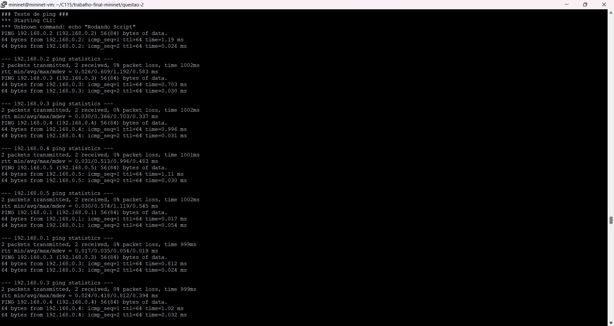
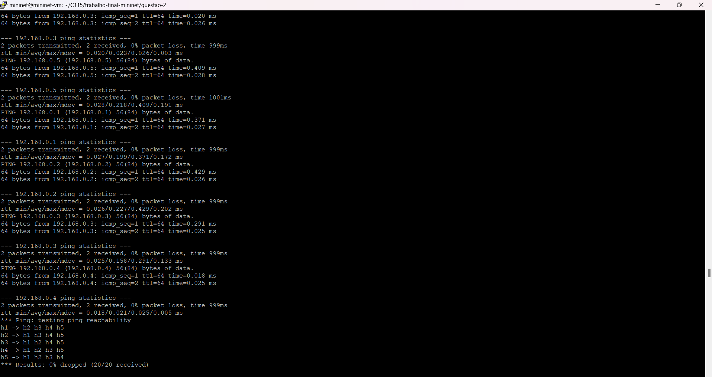

### e) Apague as regras anteriores e crie regras baseadas em endereços MAC para alguns nós. (Deve-se comunicar hosts dos diferentes switches);

#### Resultado
```bash
### Limpar regras ###

### Adicionar novas regras ###
NXST_FLOW reply (xid=0x4):
 cookie=0x0, duration=0.088s, table=0, n_packets=0, n_bytes=0, idle_age=0, dl_sr                                                                                                             c=00:00:00:00:00:01,dl_dst=00:00:00:00:00:02 actions=output:2
 cookie=0x0, duration=0.075s, table=0, n_packets=0, n_bytes=0, idle_age=0, dl_sr                                                                                                             c=00:00:00:00:00:03,dl_dst=00:00:00:00:00:01 actions=output:1
 cookie=0x0, duration=0.081s, table=0, n_packets=0, n_bytes=0, idle_age=0, dl_sr                                                                                                             c=00:00:00:00:00:01,dl_dst=00:00:00:00:00:03 actions=output:3
 cookie=0x0, duration=0.063s, table=0, n_packets=0, n_bytes=0, idle_age=0, dl_sr                                                                                                             c=00:00:00:00:00:04,dl_dst=00:00:00:00:00:01 actions=output:1
 cookie=0x0, duration=0.073s, table=0, n_packets=0, n_bytes=0, idle_age=0, dl_sr                                                                                                             c=00:00:00:00:00:01,dl_dst=00:00:00:00:00:04 actions=output:3
 cookie=0x0, duration=0.034s, table=0, n_packets=0, n_bytes=0, idle_age=0, dl_sr                                                                                                             c=00:00:00:00:00:04,dl_dst=00:00:00:00:00:02 actions=output:2
 cookie=0x0, duration=0.043s, table=0, n_packets=0, n_bytes=0, idle_age=0, dl_sr                                                                                                             c=00:00:00:00:00:02,dl_dst=00:00:00:00:00:04 actions=output:3
 cookie=0x0, duration=0.083s, table=0, n_packets=0, n_bytes=0, idle_age=0, dl_sr                                                                                                             c=00:00:00:00:00:02,dl_dst=00:00:00:00:00:01 actions=output:1
 cookie=0x0, duration=0.062s, table=0, n_packets=0, n_bytes=0, idle_age=0, dl_sr                                                                                                             c=00:00:00:00:00:01,dl_dst=00:00:00:00:00:05 actions=output:3
 cookie=0x0, duration=0.023s, table=0, n_packets=0, n_bytes=0, idle_age=0, dl_sr                                                                                                             c=00:00:00:00:00:05,dl_dst=00:00:00:00:00:02 actions=output:2
 cookie=0x0, duration=0.032s, table=0, n_packets=0, n_bytes=0, idle_age=0, dl_sr                                                                                                             c=00:00:00:00:00:02,dl_dst=00:00:00:00:00:05 actions=output:3
 cookie=0x0, duration=0.044s, table=0, n_packets=0, n_bytes=0, idle_age=0, dl_sr                                                                                                             c=00:00:00:00:00:03,dl_dst=00:00:00:00:00:02 actions=output:2
 cookie=0x0, duration=0.05s, table=0, n_packets=0, n_bytes=0, idle_age=0, dl_src                                                                                                             =00:00:00:00:00:02,dl_dst=00:00:00:00:00:03 actions=output:3
 cookie=0x0, duration=0.052s, table=0, n_packets=0, n_bytes=0, idle_age=0, dl_sr                                                                                                             c=00:00:00:00:00:05,dl_dst=00:00:00:00:00:01 actions=output:1
 cookie=0x0, duration=0.005s, table=0, n_packets=0, n_bytes=0, idle_age=0, arp,a                                                                                                             rp_op=1 actions=FLOOD

NXST_FLOW reply (xid=0x4):
 cookie=0x0, duration=0.079s, table=0, n_packets=0, n_bytes=0, idle_age=0, dl_sr                                                                                                             c=00:00:00:00:00:03,dl_dst=00:00:00:00:00:01 actions=output:2
 cookie=0x0, duration=0.025s, table=0, n_packets=0, n_bytes=0, idle_age=0, dl_sr                                                                                                             c=00:00:00:00:00:03,dl_dst=00:00:00:00:00:04 actions=output:3
 cookie=0x0, duration=0.02s, table=0, n_packets=0, n_bytes=0, idle_age=0, dl_src                                                                                                             =00:00:00:00:00:04,dl_dst=00:00:00:00:00:03 actions=output:1
 cookie=0x0, duration=0.074s, table=0, n_packets=0, n_bytes=0, idle_age=0, dl_sr                                                                                                             c=00:00:00:00:00:01,dl_dst=00:00:00:00:00:04 actions=output:3
 cookie=0x0, duration=0.013s, table=0, n_packets=0, n_bytes=0, idle_age=0, dl_sr                                                                                                             c=00:00:00:00:00:05,dl_dst=00:00:00:00:00:03 actions=output:1
 cookie=0x0, duration=0.018s, table=0, n_packets=0, n_bytes=0, idle_age=0, dl_sr                                                                                                             c=00:00:00:00:00:03,dl_dst=00:00:00:00:00:05 actions=output:3
 cookie=0x0, duration=0.057s, table=0, n_packets=0, n_bytes=0, idle_age=0, dl_sr                                                                                                             c=00:00:00:00:00:05,dl_dst=00:00:00:00:00:01 actions=output:2
 cookie=0x0, duration=0.081s, table=0, n_packets=0, n_bytes=0, idle_age=0, dl_sr                                                                                                             c=00:00:00:00:00:01,dl_dst=00:00:00:00:00:03 actions=output:1
 cookie=0x0, duration=0.068s, table=0, n_packets=0, n_bytes=0, idle_age=0, dl_sr                                                                                                             c=00:00:00:00:00:04,dl_dst=00:00:00:00:00:01 actions=output:2
 cookie=0x0, duration=0.062s, table=0, n_packets=0, n_bytes=0, idle_age=0, dl_sr                                                                                                             c=00:00:00:00:00:01,dl_dst=00:00:00:00:00:05 actions=output:3
 cookie=0x0, duration=0.044s, table=0, n_packets=0, n_bytes=0, idle_age=0, dl_sr                                                                                                             c=00:00:00:00:00:02,dl_dst=00:00:00:00:00:04 actions=output:3
 cookie=0x0, duration=0.038s, table=0, n_packets=0, n_bytes=0, idle_age=0, dl_sr                                                                                                             c=00:00:00:00:00:04,dl_dst=00:00:00:00:00:02 actions=output:2
 cookie=0x0, duration=0.049s, table=0, n_packets=0, n_bytes=0, idle_age=0, dl_sr                                                                                                             c=00:00:00:00:00:03,dl_dst=00:00:00:00:00:02 actions=output:2
 cookie=0x0, duration=0.033s, table=0, n_packets=0, n_bytes=0, idle_age=0, dl_sr                                                                                                             c=00:00:00:00:00:02,dl_dst=00:00:00:00:00:05 actions=output:3
 cookie=0x0, duration=0.028s, table=0, n_packets=0, n_bytes=0, idle_age=0, dl_sr                                                                                                             c=00:00:00:00:00:05,dl_dst=00:00:00:00:00:02 actions=output:2
 cookie=0x0, duration=0.05s, table=0, n_packets=0, n_bytes=0, idle_age=0, dl_src                                                                                                             =00:00:00:00:00:02,dl_dst=00:00:00:00:00:03 actions=output:1
 cookie=0x0, duration=0.006s, table=0, n_packets=0, n_bytes=0, idle_age=0, arp,a                                                                                                             rp_op=1 actions=FLOOD

NXST_FLOW reply (xid=0x4):
 cookie=0x0, duration=0.015s, table=0, n_packets=0, n_bytes=0, idle_age=0, dl_sr                                                                                                             c=00:00:00:00:00:04,dl_dst=00:00:00:00:00:05 actions=output:2
 cookie=0x0, duration=0.027s, table=0, n_packets=0, n_bytes=0, idle_age=0, dl_sr                                                                                                             c=00:00:00:00:00:03,dl_dst=00:00:00:00:00:04 actions=output:1
 cookie=0x0, duration=0.025s, table=0, n_packets=0, n_bytes=0, idle_age=0, dl_sr                                                                                                             c=00:00:00:00:00:04,dl_dst=00:00:00:00:00:03 actions=output:3
 cookie=0x0, duration=0.074s, table=0, n_packets=0, n_bytes=0, idle_age=0, dl_sr                                                                                                             c=00:00:00:00:00:04,dl_dst=00:00:00:00:00:01 actions=output:3
 cookie=0x0, duration=0.014s, table=0, n_packets=0, n_bytes=0, idle_age=0, dl_sr                                                                                                             c=00:00:00:00:00:05,dl_dst=00:00:00:00:00:04 actions=output:1
 cookie=0x0, duration=0.019s, table=0, n_packets=0, n_bytes=0, idle_age=0, dl_sr                                                                                                             c=00:00:00:00:00:05,dl_dst=00:00:00:00:00:03 actions=output:3
 cookie=0x0, duration=0.075s, table=0, n_packets=0, n_bytes=0, idle_age=0, dl_sr                                                                                                             c=00:00:00:00:00:01,dl_dst=00:00:00:00:00:04 actions=output:1
 cookie=0x0, duration=0.021s, table=0, n_packets=0, n_bytes=0, idle_age=0, dl_sr                                                                                                             c=00:00:00:00:00:03,dl_dst=00:00:00:00:00:05 actions=output:2
 cookie=0x0, duration=0.065s, table=0, n_packets=0, n_bytes=0, idle_age=0, dl_sr                                                                                                             c=00:00:00:00:00:01,dl_dst=00:00:00:00:00:05 actions=output:2
 cookie=0x0, duration=0.046s, table=0, n_packets=0, n_bytes=0, idle_age=0, dl_sr                                                                                                             c=00:00:00:00:00:02,dl_dst=00:00:00:00:00:04 actions=output:1
 cookie=0x0, duration=0.044s, table=0, n_packets=0, n_bytes=0, idle_age=0, dl_sr                                                                                                             c=00:00:00:00:00:04,dl_dst=00:00:00:00:00:02 actions=output:3
 cookie=0x0, duration=0.035s, table=0, n_packets=0, n_bytes=0, idle_age=0, dl_sr                                                                                                             c=00:00:00:00:00:02,dl_dst=00:00:00:00:00:05 actions=output:2
 cookie=0x0, duration=0.034s, table=0, n_packets=0, n_bytes=0, idle_age=0, dl_sr                                                                                                             c=00:00:00:00:00:05,dl_dst=00:00:00:00:00:02 actions=output:3
 cookie=0x0, duration=0.063s, table=0, n_packets=0, n_bytes=0, idle_age=0, dl_sr                                                                                                             c=00:00:00:00:00:05,dl_dst=00:00:00:00:00:01 actions=output:3
 cookie=0x0, duration=0.009s, table=0, n_packets=0, n_bytes=0, idle_age=0, arp,a                                                                                                             rp_op=1 actions=FLOOD
```

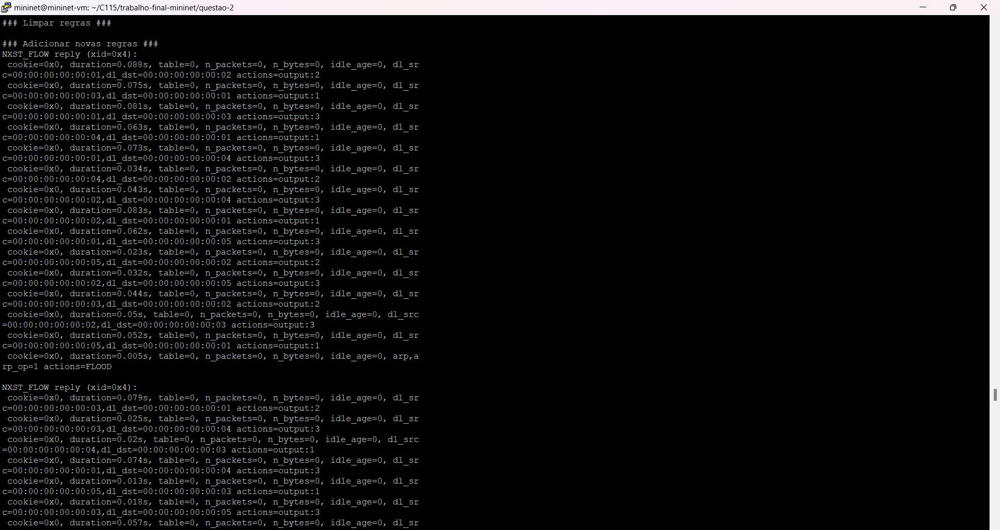
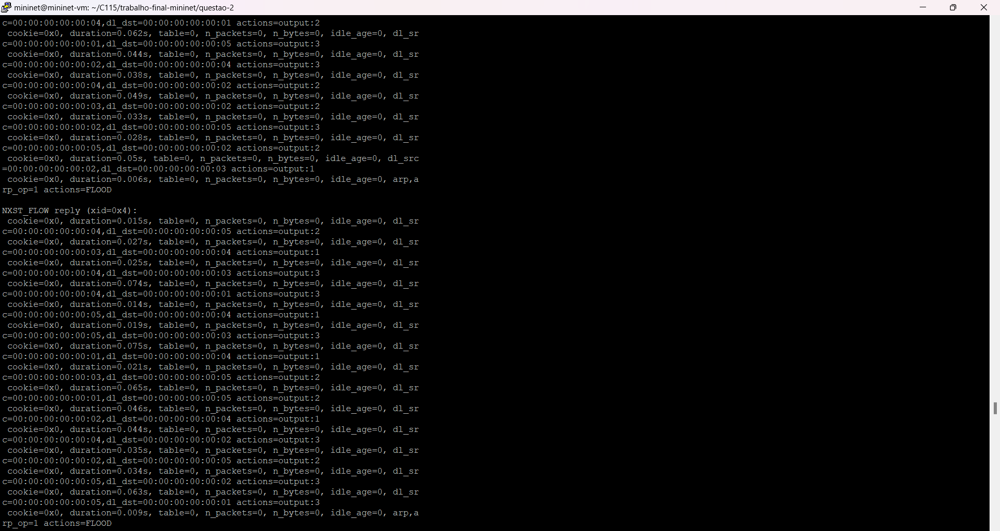

### f) Faça testes de ping para demonstrar que as regras foram bem implementadas.

#### Resultado
```bash
### Teste de ping com as regras ###
*** Starting CLI:
*** Unknown command: echo "Rodando Script"
PING 192.168.0.2 (192.168.0.2) 56(84) bytes of data.
64 bytes from 192.168.0.2: icmp_seq=1 ttl=64 time=0.271 ms
64 bytes from 192.168.0.2: icmp_seq=2 ttl=64 time=0.025 ms

--- 192.168.0.2 ping statistics ---
2 packets transmitted, 2 received, 0% packet loss, time 999ms
rtt min/avg/max/mdev = 0.025/0.148/0.271/0.123 ms
PING 192.168.0.3 (192.168.0.3) 56(84) bytes of data.
64 bytes from 192.168.0.3: icmp_seq=1 ttl=64 time=0.348 ms
64 bytes from 192.168.0.3: icmp_seq=2 ttl=64 time=0.025 ms

--- 192.168.0.3 ping statistics ---
2 packets transmitted, 2 received, 0% packet loss, time 999ms
rtt min/avg/max/mdev = 0.025/0.186/0.348/0.162 ms
PING 192.168.0.4 (192.168.0.4) 56(84) bytes of data.
64 bytes from 192.168.0.4: icmp_seq=1 ttl=64 time=0.452 ms
64 bytes from 192.168.0.4: icmp_seq=2 ttl=64 time=0.030 ms

--- 192.168.0.4 ping statistics ---
2 packets transmitted, 2 received, 0% packet loss, time 999ms
rtt min/avg/max/mdev = 0.030/0.241/0.452/0.211 ms
PING 192.168.0.5 (192.168.0.5) 56(84) bytes of data.
64 bytes from 192.168.0.5: icmp_seq=1 ttl=64 time=0.483 ms
64 bytes from 192.168.0.5: icmp_seq=2 ttl=64 time=0.025 ms

--- 192.168.0.5 ping statistics ---
2 packets transmitted, 2 received, 0% packet loss, time 999ms
rtt min/avg/max/mdev = 0.025/0.254/0.483/0.229 ms
PING 192.168.0.1 (192.168.0.1) 56(84) bytes of data.
64 bytes from 192.168.0.1: icmp_seq=1 ttl=64 time=0.016 ms
64 bytes from 192.168.0.1: icmp_seq=2 ttl=64 time=0.026 ms

--- 192.168.0.1 ping statistics ---
2 packets transmitted, 2 received, 0% packet loss, time 999ms
rtt min/avg/max/mdev = 0.016/0.021/0.026/0.005 ms
PING 192.168.0.3 (192.168.0.3) 56(84) bytes of data.
64 bytes from 192.168.0.3: icmp_seq=1 ttl=64 time=0.316 ms
64 bytes from 192.168.0.3: icmp_seq=2 ttl=64 time=0.027 ms

--- 192.168.0.3 ping statistics ---
2 packets transmitted, 2 received, 0% packet loss, time 999ms
rtt min/avg/max/mdev = 0.027/0.171/0.316/0.145 ms
PING 192.168.0.4 (192.168.0.4) 56(84) bytes of data.
64 bytes from 192.168.0.4: icmp_seq=1 ttl=64 time=0.405 ms
64 bytes from 192.168.0.4: icmp_seq=2 ttl=64 time=0.027 ms

--- 192.168.0.4 ping statistics ---
2 packets transmitted, 2 received, 0% packet loss, time 999ms
rtt min/avg/max/mdev = 0.027/0.216/0.405/0.189 ms
PING 192.168.0.5 (192.168.0.5) 56(84) bytes of data.
64 bytes from 192.168.0.5: icmp_seq=1 ttl=64 time=0.648 ms
64 bytes from 192.168.0.5: icmp_seq=2 ttl=64 time=0.030 ms

--- 192.168.0.5 ping statistics ---
2 packets transmitted, 2 received, 0% packet loss, time 1000ms
rtt min/avg/max/mdev = 0.030/0.339/0.648/0.309 ms
PING 192.168.0.1 (192.168.0.1) 56(84) bytes of data.
64 bytes from 192.168.0.1: icmp_seq=1 ttl=64 time=0.297 ms
64 bytes from 192.168.0.1: icmp_seq=2 ttl=64 time=0.025 ms

--- 192.168.0.1 ping statistics ---
2 packets transmitted, 2 received, 0% packet loss, time 999ms
rtt min/avg/max/mdev = 0.025/0.161/0.297/0.136 ms
PING 192.168.0.2 (192.168.0.2) 56(84) bytes of data.
64 bytes from 192.168.0.2: icmp_seq=1 ttl=64 time=0.020 ms
64 bytes from 192.168.0.2: icmp_seq=2 ttl=64 time=0.024 ms

--- 192.168.0.2 ping statistics ---
2 packets transmitted, 2 received, 0% packet loss, time 999ms
rtt min/avg/max/mdev = 0.020/0.022/0.024/0.002 ms
PING 192.168.0.4 (192.168.0.4) 56(84) bytes of data.
64 bytes from 192.168.0.4: icmp_seq=1 ttl=64 time=0.341 ms
64 bytes from 192.168.0.4: icmp_seq=2 ttl=64 time=0.025 ms

--- 192.168.0.4 ping statistics ---
2 packets transmitted, 2 received, 0% packet loss, time 999ms
rtt min/avg/max/mdev = 0.025/0.183/0.341/0.158 ms
PING 192.168.0.5 (192.168.0.5) 56(84) bytes of data.
64 bytes from 192.168.0.5: icmp_seq=1 ttl=64 time=0.441 ms
64 bytes from 192.168.0.5: icmp_seq=2 ttl=64 time=0.025 ms

--- 192.168.0.5 ping statistics ---
2 packets transmitted, 2 received, 0% packet loss, time 999ms
rtt min/avg/max/mdev = 0.025/0.233/0.441/0.208 ms
PING 192.168.0.1 (192.168.0.1) 56(84) bytes of data.
64 bytes from 192.168.0.1: icmp_seq=1 ttl=64 time=0.427 ms
64 bytes from 192.168.0.1: icmp_seq=2 ttl=64 time=0.030 ms

--- 192.168.0.1 ping statistics ---
2 packets transmitted, 2 received, 0% packet loss, time 999ms
rtt min/avg/max/mdev = 0.030/0.228/0.427/0.199 ms
PING 192.168.0.2 (192.168.0.2) 56(84) bytes of data.
64 bytes from 192.168.0.2: icmp_seq=1 ttl=64 time=0.545 ms
64 bytes from 192.168.0.2: icmp_seq=2 ttl=64 time=0.031 ms

--- 192.168.0.2 ping statistics ---
2 packets transmitted, 2 received, 0% packet loss, time 1002ms
rtt min/avg/max/mdev = 0.031/0.288/0.545/0.257 ms
PING 192.168.0.3 (192.168.0.3) 56(84) bytes of data.
64 bytes from 192.168.0.3: icmp_seq=1 ttl=64 time=0.046 ms
64 bytes from 192.168.0.3: icmp_seq=2 ttl=64 time=0.029 ms

--- 192.168.0.3 ping statistics ---
2 packets transmitted, 2 received, 0% packet loss, time 999ms
rtt min/avg/max/mdev = 0.029/0.037/0.046/0.010 ms
PING 192.168.0.5 (192.168.0.5) 56(84) bytes of data.
64 bytes from 192.168.0.5: icmp_seq=1 ttl=64 time=0.179 ms
64 bytes from 192.168.0.5: icmp_seq=2 ttl=64 time=0.023 ms

--- 192.168.0.5 ping statistics ---
2 packets transmitted, 2 received, 0% packet loss, time 999ms
rtt min/avg/max/mdev = 0.023/0.101/0.179/0.078 ms
PING 192.168.0.1 (192.168.0.1) 56(84) bytes of data.
64 bytes from 192.168.0.1: icmp_seq=1 ttl=64 time=0.393 ms
64 bytes from 192.168.0.1: icmp_seq=2 ttl=64 time=0.027 ms

--- 192.168.0.1 ping statistics ---
2 packets transmitted, 2 received, 0% packet loss, time 999ms
rtt min/avg/max/mdev = 0.027/0.210/0.393/0.183 ms
PING 192.168.0.2 (192.168.0.2) 56(84) bytes of data.
64 bytes from 192.168.0.2: icmp_seq=1 ttl=64 time=0.477 ms
64 bytes from 192.168.0.2: icmp_seq=2 ttl=64 time=0.027 ms

--- 192.168.0.2 ping statistics ---
2 packets transmitted, 2 received, 0% packet loss, time 999ms
rtt min/avg/max/mdev = 0.027/0.252/0.477/0.225 ms
PING 192.168.0.3 (192.168.0.3) 56(84) bytes of data.
64 bytes from 192.168.0.3: icmp_seq=1 ttl=64 time=0.329 ms
64 bytes from 192.168.0.3: icmp_seq=2 ttl=64 time=0.025 ms

--- 192.168.0.3 ping statistics ---
2 packets transmitted, 2 received, 0% packet loss, time 999ms
rtt min/avg/max/mdev = 0.025/0.177/0.329/0.152 ms
PING 192.168.0.4 (192.168.0.4) 56(84) bytes of data.
64 bytes from 192.168.0.4: icmp_seq=1 ttl=64 time=0.018 ms
64 bytes from 192.168.0.4: icmp_seq=2 ttl=64 time=0.023 ms

--- 192.168.0.4 ping statistics ---
2 packets transmitted, 2 received, 0% packet loss, time 999ms
rtt min/avg/max/mdev = 0.018/0.020/0.023/0.005 ms
*** Ping: testing ping reachability
h1 -> h2 h3 h4 h5
h2 -> h1 h3 h4 h5
h3 -> h1 h2 h4 h5
h4 -> h1 h2 h3 h5
h5 -> h1 h2 h3 h4
*** Results: 0% dropped (20/20 received)
*** Stopping 0 controllers

*** Stopping 7 links
.......
*** Stopping 3 switches
s1 s2 s3
*** Stopping 5 hosts
h1 h2 h3 h4 h5
*** Done
```

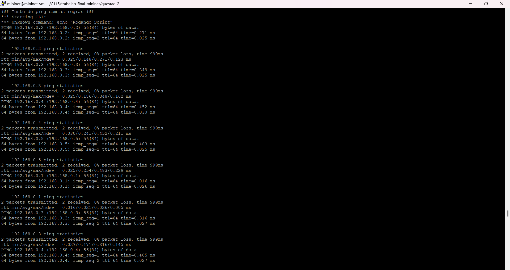
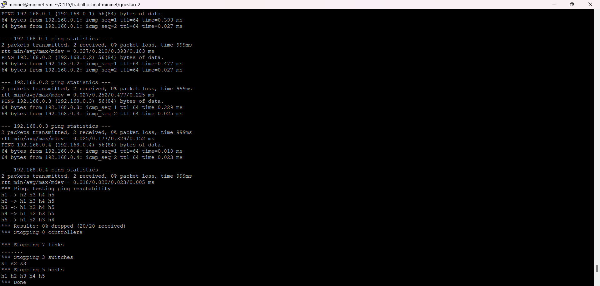