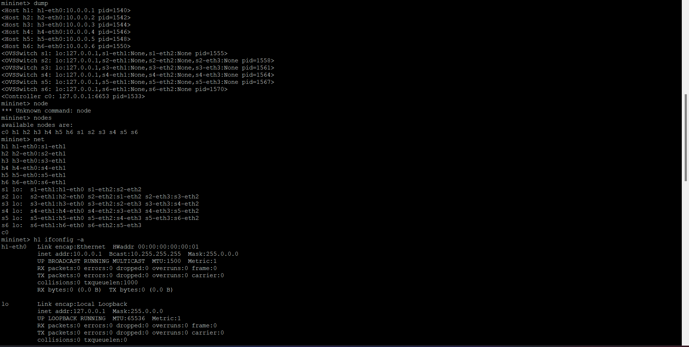
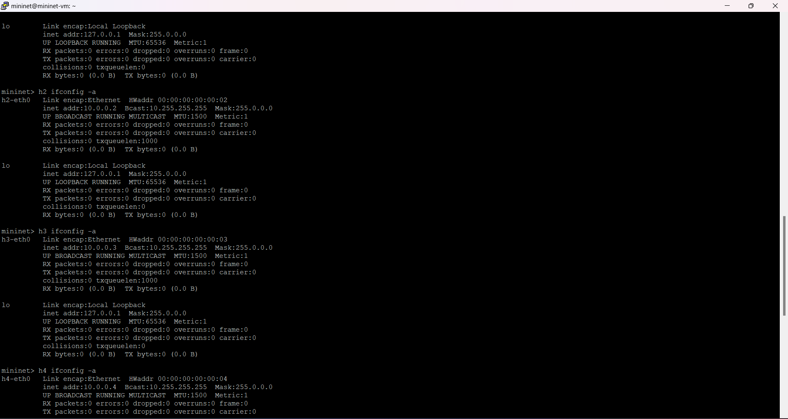
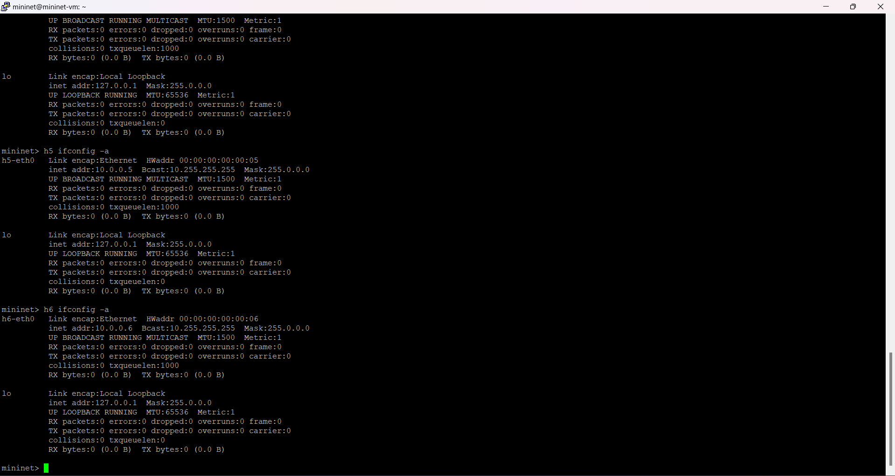
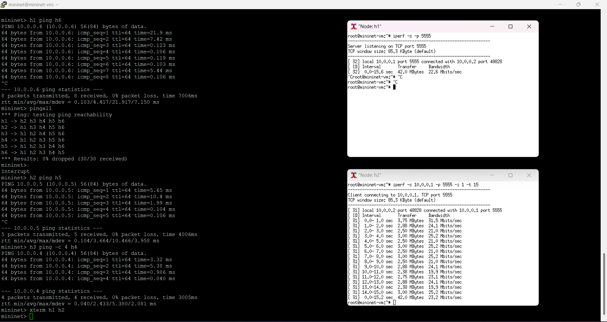

# Trabalho Mininet
## 1. Com uso de linha de comando padrão do Mininet, crie a topologia considerando o endereçoo MAC padronizado, largura de banda bw de 25Mbps e controlador do Mininet (não precisa especificar):

### Código:
sudo mn -c
sudo mn --topo=linear,6 --link tc,bw=25 --mac

```shell
mininet@mininet-vm:~$ sudo mn -c
*** Removing excess controllers/ofprotocols/ofdatapaths/pings/noxes
killall controller ofprotocol ofdatapath ping nox_core lt-nox_core ovs-openflowd ovs-controller udpbwtest mnexec ivs 2> /dev/null
killall -9 controller ofprotocol ofdatapath ping nox_core lt-nox_core ovs-openflowd ovs-controller udpbwtest mnexec ivs 2> /dev/null
pkill -9 -f "sudo mnexec"
*** Removing junk from /tmp
rm -f /tmp/vconn* /tmp/vlogs* /tmp/*.out /tmp/*.log
*** Removing old X11 tunnels
*** Removing excess kernel datapaths
ps ax | egrep -o 'dp[0-9]+' | sed 's/dp/nl:/'
***  Removing OVS datapaths
ovs-vsctl --timeout=1 list-br
ovs-vsctl --timeout=1 list-br
*** Removing all links of the pattern foo-ethX
ip link show | egrep -o '([-_.[:alnum:]]+-eth[[:digit:]]+)'
ip link show
*** Killing stale mininet node processes
pkill -9 -f mininet:
*** Shutting down stale tunnels
pkill -9 -f Tunnel=Ethernet
pkill -9 -f .ssh/mn
rm -f ~/.ssh/mn/*
*** Cleanup complete.
mininet@mininet-vm:~$ sudo mn --topo=linear,6 --link tc,bw=25 --mac
*** Creating network
*** Adding controller
*** Adding hosts:
h1 h2 h3 h4 h5 h6
*** Adding switches:
s1 s2 s3 s4 s5 s6
*** Adding links:
(25.00Mbit) (25.00Mbit) (h1, s1) (25.00Mbit) (25.00Mbit) (h2, s2) (25.00Mbit) (25.00Mbit) (h3, s3) (25.00Mbit) (25.00Mbit) (h4, s4) (25.00Mbit) (25.00Mbit) (h5, s5) (25.00Mbit) (25.00Mbit) (h6, s6) (25.00Mbit) (25.00Mbit) (s2, s1) (25.00Mbit) (25.00Mbit) (s3, s2) (25.00Mbit) (25.00Mbit) (s4, s3) (25.00Mbit) (25.00Mbit) (s5, s4) (25.00Mbit) (25.00Mbit) (s6, s5)
*** Configuring hosts
h1 h2 h3 h4 h5 h6
*** Starting controller
c0
*** Starting 6 switches
s1 s2 s3 s4 s5 s6 ...(25.00Mbit) (25.00Mbit) (25.00Mbit) (25.00Mbit) (25.00Mbit) (25.00Mbit) (25.00Mbit) (25.00Mbit) (25.00Mbit) (25.00Mbit) (25.00Mbit) (25.00Mbit) (25.00Mbit) (25.00Mbit) (25.00Mbit) (25.00Mbit)
```
### Resultado: 

 
## 2. Inspecione informações das interfaces, endereçoos MAC, IP e portas através de linhas de comando:
### Código
dump
nodes
net
h1 ifconfig -a
h2 ifconfig -a
h3 ifconfig -a
h4 ifconfig -a
h5 ifconfig -a
h6 ifconfig -a

```shell
mininet> dump
<Host h1: h1-eth0:10.0.0.1 pid=1540>
<Host h2: h2-eth0:10.0.0.2 pid=1542>
<Host h3: h3-eth0:10.0.0.3 pid=1544>
<Host h4: h4-eth0:10.0.0.4 pid=1546>
<Host h5: h5-eth0:10.0.0.5 pid=1548>
<Host h6: h6-eth0:10.0.0.6 pid=1550>
<OVSSwitch s1: lo:127.0.0.1,s1-eth1:None,s1-eth2:None pid=1555>
<OVSSwitch s2: lo:127.0.0.1,s2-eth1:None,s2-eth2:None,s2-eth3:None pid=1558>
<OVSSwitch s3: lo:127.0.0.1,s3-eth1:None,s3-eth2:None,s3-eth3:None pid=1561>
<OVSSwitch s4: lo:127.0.0.1,s4-eth1:None,s4-eth2:None,s4-eth3:None pid=1564>
<OVSSwitch s5: lo:127.0.0.1,s5-eth1:None,s5-eth2:None,s5-eth3:None pid=1567>
<OVSSwitch s6: lo:127.0.0.1,s6-eth1:None,s6-eth2:None pid=1570>
<Controller c0: 127.0.0.1:6653 pid=1533>

mininet> nodes
available nodes are:
c0 h1 h2 h3 h4 h5 h6 s1 s2 s3 s4 s5 s6

h1 h1-eth0:s1-eth1
h2 h2-eth0:s2-eth1
h3 h3-eth0:s3-eth1
h4 h4-eth0:s4-eth1
h5 h5-eth0:s5-eth1
h6 h6-eth0:s6-eth1
s1 lo:  s1-eth1:h1-eth0 s1-eth2:s2-eth2
s2 lo:  s2-eth1:h2-eth0 s2-eth2:s1-eth2 s2-eth3:s3-eth2
s3 lo:  s3-eth1:h3-eth0 s3-eth2:s2-eth3 s3-eth3:s4-eth2
s4 lo:  s4-eth1:h4-eth0 s4-eth2:s3-eth3 s4-eth3:s5-eth2
s5 lo:  s5-eth1:h5-eth0 s5-eth2:s4-eth3 s5-eth3:s6-eth2
s6 lo:  s6-eth1:h6-eth0 s6-eth2:s5-eth3
c0

mininet> h1 ifconfig -a
h1-eth0   Link encap:Ethernet  HWaddr 00:00:00:00:00:01
          inet addr:10.0.0.1  Bcast:10.255.255.255  Mask:255.0.0.0
          UP BROADCAST RUNNING MULTICAST  MTU:1500  Metric:1
          RX packets:0 errors:0 dropped:0 overruns:0 frame:0
          TX packets:0 errors:0 dropped:0 overruns:0 carrier:0
          collisions:0 txqueuelen:1000
          RX bytes:0 (0.0 B)  TX bytes:0 (0.0 B)

lo        Link encap:Local Loopback
          inet addr:127.0.0.1  Mask:255.0.0.0
          UP LOOPBACK RUNNING  MTU:65536  Metric:1
          RX packets:0 errors:0 dropped:0 overruns:0 frame:0
          TX packets:0 errors:0 dropped:0 overruns:0 carrier:0
          collisions:0 txqueuelen:0
          RX bytes:0 (0.0 B)  TX bytes:0 (0.0 B)

mininet> h2 ifconfig -a
h2-eth0   Link encap:Ethernet  HWaddr 00:00:00:00:00:02
          inet addr:10.0.0.2  Bcast:10.255.255.255  Mask:255.0.0.0
          UP BROADCAST RUNNING MULTICAST  MTU:1500  Metric:1
          RX packets:0 errors:0 dropped:0 overruns:0 frame:0
          TX packets:0 errors:0 dropped:0 overruns:0 carrier:0
          collisions:0 txqueuelen:1000
          RX bytes:0 (0.0 B)  TX bytes:0 (0.0 B)

lo        Link encap:Local Loopback
          inet addr:127.0.0.1  Mask:255.0.0.0
          UP LOOPBACK RUNNING  MTU:65536  Metric:1
          RX packets:0 errors:0 dropped:0 overruns:0 frame:0
          TX packets:0 errors:0 dropped:0 overruns:0 carrier:0
          collisions:0 txqueuelen:0
          RX bytes:0 (0.0 B)  TX bytes:0 (0.0 B)

mininet> h3 ifconfig -a
h3-eth0   Link encap:Ethernet  HWaddr 00:00:00:00:00:03
          inet addr:10.0.0.3  Bcast:10.255.255.255  Mask:255.0.0.0
          UP BROADCAST RUNNING MULTICAST  MTU:1500  Metric:1
          RX packets:0 errors:0 dropped:0 overruns:0 frame:0
          TX packets:0 errors:0 dropped:0 overruns:0 carrier:0
          collisions:0 txqueuelen:1000
          RX bytes:0 (0.0 B)  TX bytes:0 (0.0 B)

lo        Link encap:Local Loopback
          inet addr:127.0.0.1  Mask:255.0.0.0
          UP LOOPBACK RUNNING  MTU:65536  Metric:1
          RX packets:0 errors:0 dropped:0 overruns:0 frame:0
          TX packets:0 errors:0 dropped:0 overruns:0 carrier:0
          collisions:0 txqueuelen:0
          RX bytes:0 (0.0 B)  TX bytes:0 (0.0 B)

mininet> h4 ifconfig -a
h4-eth0   Link encap:Ethernet  HWaddr 00:00:00:00:00:04
          inet addr:10.0.0.4  Bcast:10.255.255.255  Mask:255.0.0.0
          UP BROADCAST RUNNING MULTICAST  MTU:1500  Metric:1
          RX packets:0 errors:0 dropped:0 overruns:0 frame:0
          TX packets:0 errors:0 dropped:0 overruns:0 carrier:0
          collisions:0 txqueuelen:1000
          RX bytes:0 (0.0 B)  TX bytes:0 (0.0 B)

lo        Link encap:Local Loopback
          inet addr:127.0.0.1  Mask:255.0.0.0
          UP LOOPBACK RUNNING  MTU:65536  Metric:1
          RX packets:0 errors:0 dropped:0 overruns:0 frame:0
          TX packets:0 errors:0 dropped:0 overruns:0 carrier:0
          collisions:0 txqueuelen:0
          RX bytes:0 (0.0 B)  TX bytes:0 (0.0 B)

mininet> h5 ifconfig -a
h5-eth0   Link encap:Ethernet  HWaddr 00:00:00:00:00:05
          inet addr:10.0.0.5  Bcast:10.255.255.255  Mask:255.0.0.0
          UP BROADCAST RUNNING MULTICAST  MTU:1500  Metric:1
          RX packets:0 errors:0 dropped:0 overruns:0 frame:0
          TX packets:0 errors:0 dropped:0 overruns:0 carrier:0
          collisions:0 txqueuelen:1000
          RX bytes:0 (0.0 B)  TX bytes:0 (0.0 B)

lo        Link encap:Local Loopback
          inet addr:127.0.0.1  Mask:255.0.0.0
          UP LOOPBACK RUNNING  MTU:65536  Metric:1
          RX packets:0 errors:0 dropped:0 overruns:0 frame:0
          TX packets:0 errors:0 dropped:0 overruns:0 carrier:0
          collisions:0 txqueuelen:0
          RX bytes:0 (0.0 B)  TX bytes:0 (0.0 B)

mininet> h6 ifconfig -a
h6-eth0   Link encap:Ethernet  HWaddr 00:00:00:00:00:06
          inet addr:10.0.0.6  Bcast:10.255.255.255  Mask:255.0.0.0
          UP BROADCAST RUNNING MULTICAST  MTU:1500  Metric:1
          RX packets:0 errors:0 dropped:0 overruns:0 frame:0
          TX packets:0 errors:0 dropped:0 overruns:0 carrier:0
          collisions:0 txqueuelen:1000
          RX bytes:0 (0.0 B)  TX bytes:0 (0.0 B)

lo        Link encap:Local Loopback
          inet addr:127.0.0.1  Mask:255.0.0.0
          UP LOOPBACK RUNNING  MTU:65536  Metric:1
          RX packets:0 errors:0 dropped:0 overruns:0 frame:0
          TX packets:0 errors:0 dropped:0 overruns:0 carrier:0
          collisions:0 txqueuelen:0
          RX bytes:0 (0.0 B)  TX bytes:0 (0.0 B)

```
### Resultados




## 3. Execute testes de ping entre os diferentes nós:
### Código
h1 ping h6
h2 ping h5
h3 ping h4
pingall

```shell
mininet> h1 ping h6
PING 10.0.0.6 (10.0.0.6) 56(84) bytes of data.
64 bytes from 10.0.0.6: icmp_seq=1 ttl=64 time=21.9 ms
64 bytes from 10.0.0.6: icmp_seq=2 ttl=64 time=7.42 ms
64 bytes from 10.0.0.6: icmp_seq=3 ttl=64 time=0.123 ms
64 bytes from 10.0.0.6: icmp_seq=4 ttl=64 time=0.106 ms
64 bytes from 10.0.0.6: icmp_seq=5 ttl=64 time=0.119 ms
64 bytes from 10.0.0.6: icmp_seq=6 ttl=64 time=0.103 ms
64 bytes from 10.0.0.6: icmp_seq=7 ttl=64 time=5.44 ms
64 bytes from 10.0.0.6: icmp_seq=8 ttl=64 time=0.106 ms
^C
--- 10.0.0.6 ping statistics ---
8 packets transmitted, 8 received, 0% packet loss, time 7006ms
rtt min/avg/max/mdev = 0.103/4.417/21.917/7.150 ms

mininet> h2 ping h5
PING 10.0.0.5 (10.0.0.5) 56(84) bytes of data.
64 bytes from 10.0.0.5: icmp_seq=1 ttl=64 time=5.65 ms
64 bytes from 10.0.0.5: icmp_seq=2 ttl=64 time=10.4 ms
64 bytes from 10.0.0.5: icmp_seq=3 ttl=64 time=1.99 ms
64 bytes from 10.0.0.5: icmp_seq=4 ttl=64 time=0.104 ms
64 bytes from 10.0.0.5: icmp_seq=5 ttl=64 time=0.106 ms
^C
--- 10.0.0.5 ping statistics ---
5 packets transmitted, 5 received, 0% packet loss, time 4006ms
rtt min/avg/max/mdev = 0.104/3.664/10.466/3.958 ms
mininet> h3 ping -c 4 h4
PING 10.0.0.4 (10.0.0.4) 56(84) bytes of data.
64 bytes from 10.0.0.4: icmp_seq=1 ttl=64 time=3.32 ms
64 bytes from 10.0.0.4: icmp_seq=2 ttl=64 time=5.38 ms
64 bytes from 10.0.0.4: icmp_seq=3 ttl=64 time=0.986 ms
64 bytes from 10.0.0.4: icmp_seq=4 ttl=64 time=0.040 ms

--- 10.0.0.4 ping statistics ---
4 packets transmitted, 4 received, 0% packet loss, time 3005ms
rtt min/avg/max/mdev = 0.040/2.433/5.380/2.081 ms

mininet> pingall
*** Ping: testing ping reachability
h1 -> h2 h3 h4 h5 h6
h2 -> h1 h3 h4 h5 h6
h3 -> h1 h2 h4 h5 h6
h4 -> h1 h2 h3 h5 h6
h5 -> h1 h2 h3 h4 h6
h6 -> h1 h2 h3 h4 h5
*** Results: 0% dropped (30/30 received)
```
### Resultado


## 4. Especifique que o host 1 na porta 5555 vai ser um servidor TCP e o host 2 um cliente e execute testes de iperf, considere um relatório por segundo com teste de 15 segundos.
### Código
xterm h1 h2
Em h1 (servidor):
	iperf -s -p 5555
Em h2 (cliente):
	iperf -c 10.0.0.1 -p 5555 -i 1 -t 15

```shell
#no mininet
mininet> xterm h1 h2

#no h1 (servidor)
root@mininet-vm:~# iperf -s -p 5555
------------------------------------------------------------
Server listening on TCP port 5555
TCP window size: 85.3 KByte (default)
------------------------------------------------------------
[ 32] local 10.0.0.1 port 5555 connected with 10.0.0.2 port 48828
[ ID] Interval       Transfer     Bandwidth
[ 32]  0.0-15.6 sec  42.0 MBytes  22.6 Mbits/sec

#no h2 (cliente)
root@mininet-vm:~# iperf -c 10.0.0.1 -p 5555 -i 1 -t 15
------------------------------------------------------------
Client connecting to 10.0.0.1, TCP port 5555
TCP window size: 85.3 KByte (default)
------------------------------------------------------------
[ 31] local 10.0.0.2 port 48828 connected with 10.0.0.1 port 5555
[ ID] Interval       Transfer     Bandwidth
[ 31]  0.0- 1.0 sec  3.75 MBytes  31.5 Mbits/sec
[ 31]  1.0- 2.0 sec  2.88 MBytes  24.1 Mbits/sec
[ 31]  2.0- 3.0 sec  2.88 MBytes  24.1 Mbits/sec
[ 31]  3.0- 4.0 sec  3.00 MBytes  25.2 Mbits/sec
[ 31]  4.0- 5.0 sec  2.88 MBytes  24.1 Mbits/sec
[ 31]  5.0- 6.0 sec  3.00 MBytes  25.2 Mbits/sec
[ 31]  6.0- 7.0 sec  3.00 MBytes  25.2 Mbits/sec
[ 31]  7.0- 8.0 sec  3.00 MBytes  25.2 Mbits/sec
[ 31]  8.0- 9.0 sec  2.88 MBytes  24.1 Mbits/sec
[ 31]  9.0-10.0 sec  2.88 MBytes  24.1 Mbits/sec
[ 31] 10.0-11.0 sec  2.38 MBytes  19.9 Mbits/sec
[ 31] 11.0-12.0 sec  2.75 MBytes  23.1 Mbits/sec
[ 31] 12.0-13.0 sec  2.38 MBytes  19.9 Mbits/sec
[ 31] 13.0-14.0 sec  2.38 MBytes  19.9 Mbits/sec
[ 31] 14.0-15.0 sec  3.00 MBytes  25.2 Mbits/sec
[ 31]  0.0-15.2 sec  42.0 MBytes  23.2 Mbits/sec
```
### Resultado

